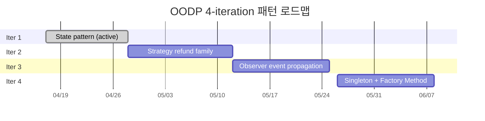
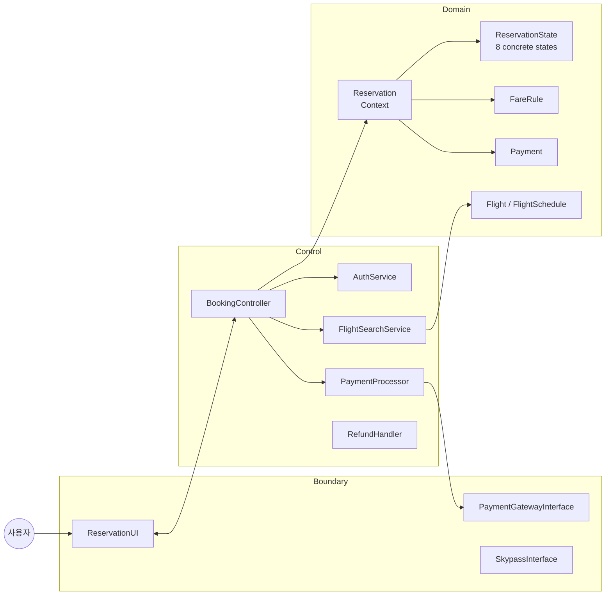
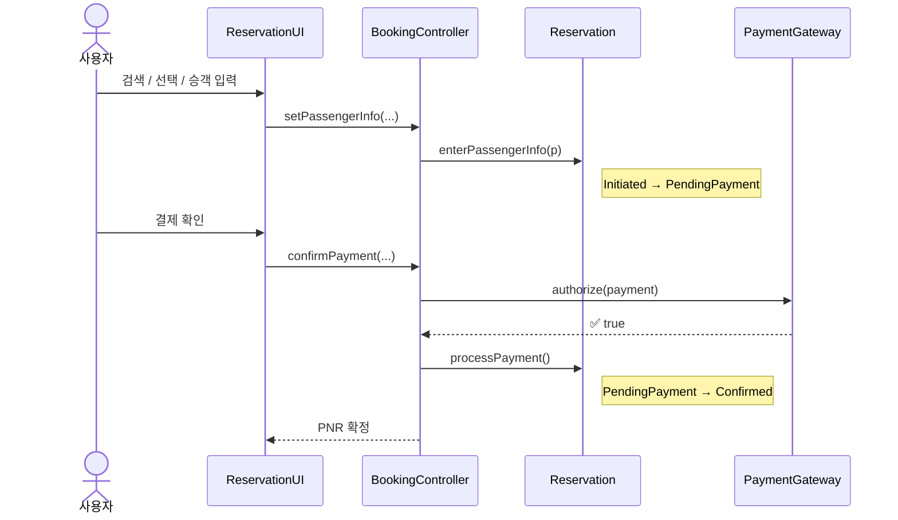
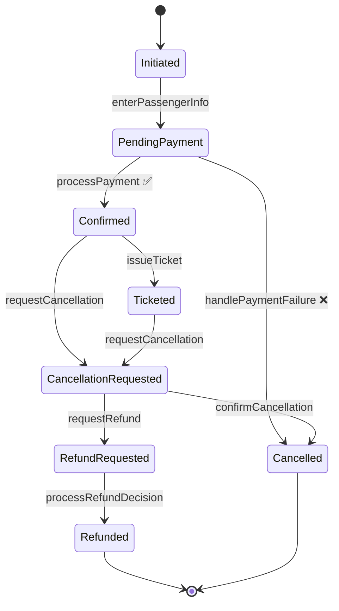

<div align="center">

# ✈️ 대한항공 Skypass 티켓 예약 시스템

**한동대학교 · ECE312 객체지향 설계패턴 · 2026년 1학기 · 설계프로젝트 #2 · A팀**

[](https://openjdk.org/)
[](https://www.eclipse.org/)
[](http://amateras.sourceforge.jp/)
[](https://en.wikipedia.org/wiki/Design_Patterns)
[](#-진행-상태)
[](#%EF%B8%8F-라이선스-및-학술-무결성)

</div>

---

설계프로젝트 #1에서 만든 UML 모델을 자바 데스크톱 애플리케이션으로 구현하고, 4번의 iteration을 거치며 점진적으로 정제해 나가는 프로젝트. 각 iteration은 하나의 주축 디자인 패턴을 중심에 둔다.

> [!NOTE]
> 본 저장소는 진행 중인 산출물입니다. iteration 1 **walking skeleton**이 끝까지 동작하며, iteration 2부터는 계획 단계입니다 (자세한 계획은 [`docs/proposal-0/`](docs/proposal-0/) 참조).

---

## 📌 진행 상태

| Iteration | 패턴 | 상태 | 다루는 기능 |
| :---: | :--- | :---: | :--- |
| **1** | **State** — 8개 구상 상태 클래스 | ✅ 동작 | 회원 가입 · 로그인 · 검색 · 직항 · 승객 · 결제 |
| **2** | **Strategy** — `RefundPolicy` family | 📋 계획 | 취소 · 환불 · e-Ticket · 예약 조회 |
| **3** | **Observer** — 비동기 이벤트 전파 | 📋 계획 | 환승 · multi-city · 마일리지 · 자동 취소 |
| **4** | **Singleton** + 옵션 **Factory Method** | 📋 계획 | 관리자 환불 · 전역 설정 · PDF · 실시간 추적 |

### 패턴 로드맵



---

## 🏛 아키텍처 (ECB)



<details>
<summary>📁 <b>패키지 구조 펼쳐보기</b></summary>

```
src/com/koreanair/reservation/
├── app/                    # 진입점(App, SwingApp), 목 인프라, 샘플 데이터
│   └── swing/              # Swing UI 패널 (MainFrame, LoginPanel, SearchPanel, ...)
├── boundary/               # ReservationUI, PaymentGatewayInterface, SkypassInterface
├── control/                # BookingController, AuthService, FlightSearchService,
│                           # PaymentProcessor, RefundHandler
├── domain/
│   ├── reservation/        # Reservation 애그리거트 (State 패턴의 Context)
│   │   └── state/          # 8개 *State + AbstractReservationState
│   │                       # + InvalidStateTransitionException
│   ├── flight/             # Flight, FlightSchedule, FareRule, Seat, SeatInventory, ...
│   ├── passenger/          # Passenger, MileageAccount (iter3), PassengerType
│   ├── payment/            # Payment, PaymentMethod, Refund (iter2), RefundRequest (iter2)
│   └── user/               # User, Member, Admin, GuestBookingRequester
└── tools/                  # AmaterasUML 에미터 (Generate*Diagram.java)
```

총 **69개 자바 파일**, **11개 패키지**.

</details>

---

## 🚶 Walking Skeleton (iteration 1)

iteration 1의 happy path는 `App.main(...)`에서 끝까지 동작합니다.



콘솔에서는 두 줄이 출력되어 State 전이를 직접 확인할 수 있습니다.

```
[STATE] Initiated -> PendingPayment
[STATE] PendingPayment -> Confirmed
```

또 다른 `ReservationUI` 구현체가 `app.swing.SwingApp`에 있으며, Control과 Domain 코드를 그대로 사용하면서 동일한 시나리오를 구동합니다 — **Boundary 교체가 비파괴적임을 증명하는 셈**입니다.

### State 패턴 전이도



> [!NOTE]
> Iteration 1에서는 **3개 전이만 실제로 동작**합니다 (`enterPassengerInfo`, `processPayment` 성공, `handlePaymentFailure`). 나머지 전이는 8개 `*State` 클래스에 선언만 되어 있으며, iteration 2부터 본문이 채워집니다.

---

## 🛠 빌드 및 실행

표준 Eclipse 자바 프로젝트입니다 (build tool 미도입 — Maven / Gradle은 iteration 2 작업).

### A) Eclipse

```
File → Import → Existing Projects into Workspace → clone한 디렉토리 선택
```

진입점:

| 모드 | 클래스 |
| --- | --- |
| 콘솔 | `com.koreanair.reservation.app.App` |
| Swing UI | `com.koreanair.reservation.app.swing.SwingApp` |

### B) 커맨드라인

```bash
cd src
find . -name "*.java" > sources.txt
javac -d ../bin @sources.txt
cd ..
java -cp bin com.koreanair.reservation.app.App
```

---

## 🎨 다이어그램 자동 생성

UML 다이어그램 4종(use case · class · sequence · state)은 `com.koreanair.reservation.tools` 패키지의 에미터 클래스가 소스 트리에서 자동 생성합니다.

| 에미터 | 출력 파일 |
| --- | --- |
| `GenerateUseCaseDiagram` | `reservationSystem.ucd` |
| `GenerateClassDiagram` | `classDiagram.cld` |
| `GenerateSequenceDiagrams` | `bookFlight.sqd` · `adminOperations.sqd` · `memberBookingTicket.sqd` |
| `GenerateStateDiagrams` | `reservationState.acd` · `seatState.acd` · `flightScheduleState.acd` |

각 에미터는 워크스페이스에 AmaterasUML XML 파일을 쓰며, Eclipse에서 AmaterasUML 플러그인으로 열어 PNG로 export하면 됩니다.

> [!TIP]
> 다이어그램을 손으로 그리지 않고 소스에서 자동 생성하는 이유: iteration이 진행되며 설계가 바뀌어도 한 번의 rebuild로 모든 다이어그램이 자동 동기화됩니다 — **"그림 그리기"보다 "문서 컴파일"에 가깝습니다.**

---

## 📄 제출물

iteration별 제출물은 [`docs/`](docs/) 아래에 보관합니다.

| 제출물 | 영문 (제출본) | 한국어 (검토본) |
| :--- | :---: | :---: |
| **Proposal #0** — Feature Inventory & Iteration Plan | [📄 EN](docs/proposal-0/proposal-0-feature-inventory.md) | [📄 KO](docs/proposal-0/proposal-0-feature-inventory-ko.md) |

---

## 👥 A팀

<table>
<tr>
<td align="center" width="33%">
<b>김정욱</b><br>
<sub>Jungwook Kim</sub><br><br>
🧱 <b>도메인 & 패턴</b>
</td>
<td align="center" width="33%">
<b>이재호</b><br>
<sub>Jaeho Lee</sub><br><br>
🖼 <b>Boundary</b>
</td>
<td align="center" width="33%">
<b>김경동</b><br>
<sub>Gyungdong Kim</sub><br><br>
⚙️ <b>Control & 어댑터</b>
</td>
</tr>
<tr>
<td valign="top">
<sub>
• <code>Reservation</code> 애그리거트<br>
• State · Strategy · Observer · Singleton 패턴<br>
• AmaterasUML 에미터<br>
• 통합
</sub>
</td>
<td valign="top">
<sub>
• Swing UI 패널 7종<br>
• 콘솔 프런트엔드<br>
• <code>ReservationUI</code> 구현
</sub>
</td>
<td valign="top">
<sub>
• <code>PaymentProcessor</code><br>
• <code>RefundHandler</code><br>
• <code>PaymentGatewayInterface</code> 목 구현<br>
• <code>AuthService</code><br>
• JUnit 스위트
</sub>
</td>
</tr>
</table>

---

## ⚖️ 라이선스 및 학술 무결성

> [!IMPORTANT]
> 본 저장소는 **학술·참고 목적**으로 공개됩니다. 다른 학기·다른 기관의 OODP 제출에 그대로 재사용하는 것은 학술적 부정행위에 해당하며 허용되지 않습니다.

---

<div align="center">
<sub>Made with ☕ and the Gang-of-Four book · Spring 2026</sub>
</div>
