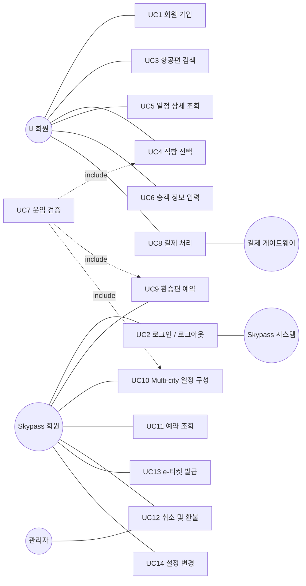
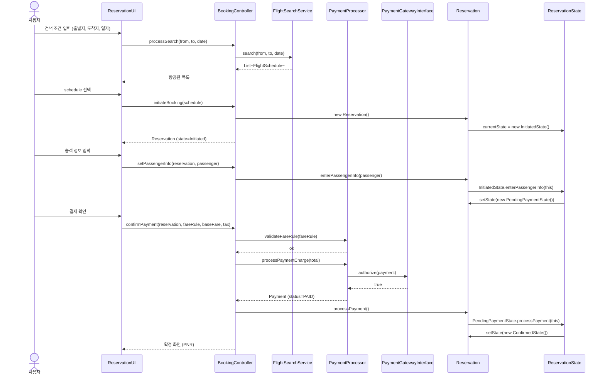
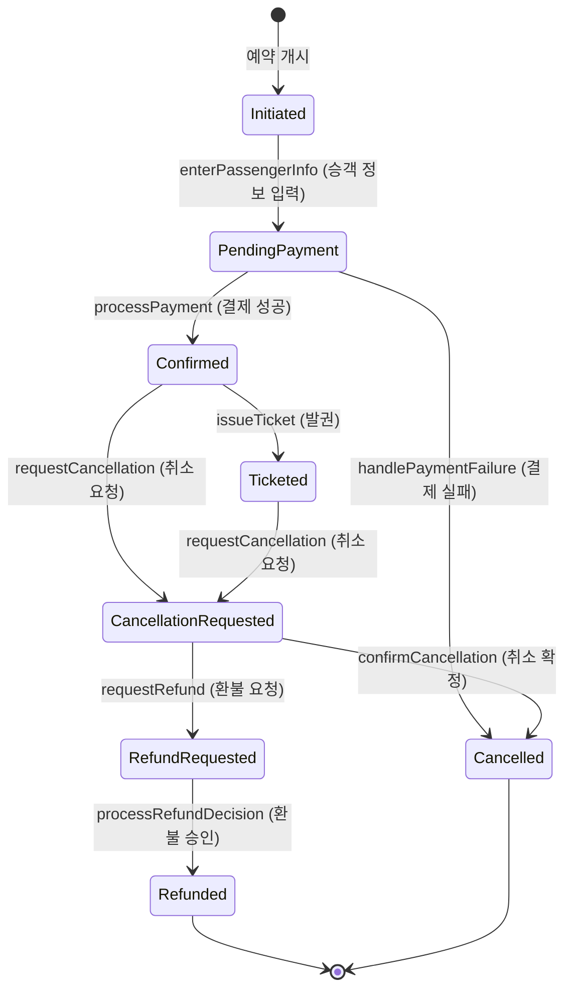

```mermaid
classDiagram
    class ReservationUI {
        <<interface>>
        +displaySearchResults(flightList) void
        +displaySeatMap(aircraftType) void
        +displayBookingConfirmation(pnrNumber) void
        +displayBookingConfirmation(reservation, payment) void
        +displayError(message) void
    }
    class PaymentGatewayInterface {
        <<interface>>
        +sendAuthorizationRequest(amount, paymentInfo) Object
        +receiveTransactionResult() Object
        +sendRefund(originalPaymentId, amount) Object
        +authorize(payment) boolean
    }
    class SkypassInterface {
        <<interface>>
    }
    class BookingController {
        -authService : AuthService
        -flightSearch : FlightSearchService
        -paymentProcessor : PaymentProcessor
        +processSearch(from, to, date) List~FlightSchedule~
        +initiateBooking(schedule) Reservation
        +setPassengerInfo(reservation, passenger) void
        +confirmPayment(reservation, fareRule, baseFare, tax) Payment
        +currentMember() Member
    }
    class AuthService {
        -memberBySkypass : Map~String, Member~
        -current : Member
        +registerSample(member, skypassNumber) void
        +login(skypassNumber, password) Member
        +logout() void
        +currentMember() Member
    }
    class FlightSearchService {
        -catalog : List~FlightSchedule~
        +addSchedule(schedule) void
        +search(from, to, date) List~FlightSchedule~
    }
    class PaymentProcessor {
        -gateway : PaymentGatewayInterface
        +validateFareRule(fareRule) boolean
        +calculateTotalAmount(baseFare, tax) long
        +processPaymentCharge(amount) Payment
    }
    class RefundHandler {
        +evaluateRefund(pnr, fareClass) Object
        +processRefund(requestId, approvedAmount) void
        +denyRefund(requestId, reason) void
    }
    class Reservation {
        -reservationId : Long
        -reservationNumber : String
        -requester : User
        -status : ReservationStatus
        -createdAt : LocalDateTime
        -passengers : List~Passenger~
        -payments : List~Payment~
        -currentState : ReservationState
        +enterPassengerInfo(passenger) void
        +processPayment() void
        +handlePaymentFailure() void
        +issueTicket() void
        +requestCancellation() void
        +confirmCancellation() void
        +requestRefund() void
        +processRefundDecision(approved) void
        +setState(next) void
        +getStateName() String
        +canBeCancelled() boolean
    }
    class ReservationState {
        <<interface>>
        +name() String
        +enterPassengerInfo(ctx) void
        +processPayment(ctx) void
        +handlePaymentFailure(ctx) void
        +issueTicket(ctx) void
        +requestCancellation(ctx) void
        +confirmCancellation(ctx) void
        +requestRefund(ctx) void
        +processRefundDecision(ctx, approved) void
    }
    class AbstractReservationState {
        <<abstract>>
        +enterPassengerInfo(ctx) void
        +processPayment(ctx) void
        +handlePaymentFailure(ctx) void
        +issueTicket(ctx) void
        +requestCancellation(ctx) void
        +confirmCancellation(ctx) void
        +requestRefund(ctx) void
        +processRefundDecision(ctx, approved) void
    }
    class InitiatedState {
        +name() String
        +enterPassengerInfo(ctx) void
    }
    class PendingPaymentState {
        +name() String
        +processPayment(ctx) void
        +handlePaymentFailure(ctx) void
    }
    class ConfirmedState {
        +name() String
        +issueTicket(ctx) void
        +requestCancellation(ctx) void
    }
    class TicketedState {
        +name() String
    }
    class CancellationRequestedState {
        +name() String
    }
    class CancelledState {
        +name() String
    }
    class RefundRequestedState {
        +name() String
    }
    class RefundedState {
        +name() String
    }
    class Passenger {
        -passengerId : Long
        -firstName : String
        -lastName : String
        -dateOfBirth : LocalDate
        -nationality : String
        -passportNumber : String
        -passengerType : PassengerType
        +getFullName() String
        +getPassengerType() PassengerType
    }
    class FareRule {
        -fareRuleId : Long
        -fareClass : String
        -refundable : boolean
        -changeFee : BigDecimal
        -cancellationPenalty : BigDecimal
        +getFareClass() String
        +isRefundable() boolean
        +getChangeFee() BigDecimal
        +getCancellationPenalty() BigDecimal
    }
    class Payment {
        -paymentId : Long
        -amount : BigDecimal
        -paymentMethod : PaymentMethod
        -status : PaymentStatus
        -paidAt : LocalDateTime
        +pay() void
        +fail() void
        +isRefundable() boolean
        +addRefund(refund) void
    }
    class FlightSchedule {
        -scheduleId : Long
        -flight : Flight
        -aircraftType : AircraftType
        -departureDateTime : LocalDateTime
        -arrivalDateTime : LocalDateTime
        -status : FlightStatus
        +isAvailableForBooking() boolean
        +findSeatInventory(bookingClass) SeatInventory
    }

    ReservationState <|.. AbstractReservationState
    AbstractReservationState <|-- InitiatedState
    AbstractReservationState <|-- PendingPaymentState
    AbstractReservationState <|-- ConfirmedState
    AbstractReservationState <|-- TicketedState
    AbstractReservationState <|-- CancellationRequestedState
    AbstractReservationState <|-- CancelledState
    AbstractReservationState <|-- RefundRequestedState
    AbstractReservationState <|-- RefundedState
    Reservation o--> ReservationState : currentState
    Reservation "1" o--> "1..*" Passenger
    Reservation "1" o--> "0..*" Payment
    Reservation --> FareRule
    BookingController --> AuthService
    BookingController --> FlightSearchService
    BookingController --> PaymentProcessor
    BookingController --> Reservation
    BookingController ..> ReservationUI
    PaymentProcessor --> PaymentGatewayInterface
    FlightSearchService --> FlightSchedule
```

# ✈️ Proposal #0 — Feature Inventory & Iteration 계획

### 대한항공 Skypass 티켓 예약 시스템

[-orange?style=flat-square)](#-1-시스템과-팀)

[**🇬🇧 English version**](proposal-0-feature-inventory.md) · [**📂 Source code**](https://github.com/gimjungwook/KoreanAirReservationDomain)

> [!TIP]
> **읽기 가이드.** §1 · §5 · §6과 색상 안내가 본 제출본에서 새로 추가한 부분(빨간색)이며, §2 · §3 · §4는 원래 Proposal#0 outline에 있던 내용을 그대로 유지했다. 발표 시에는 빨간 섹션에 시간을 더 할애하면 된다.

---

| 항목 | 내용 |
| --- | --- |
| 과목 | ECE312 객체지향 설계패턴 (2026년 1학기) |
| 제출물 | Proposal#0 — 7주차 (마감 2026-04-16, 18:00 KST) |
| 팀 | A팀 — 김정욱, 이재호, 김경동 |
| 소스 베이스라인 | `KoreanAirReservationDomain` (Eclipse 자바 프로젝트, 자바 소스 69개) |

> **색상 규칙.** 검정은 원래 Proposal#0 outline에서 그대로 가져온 내용 (Form #1 챕터 도입, Feature Inventory Table, Design Pattern Roadmap, Diagram Policy). 빨간색은 본 제출본에서 그 outline에 새로 추가된 모든 섹션·단락·표·주석을 표시한다.

---

## 📌 1. 시스템과 팀

### 1.1 시스템

본 제안은 **대한항공 Skypass 티켓 예약 시스템**을 대상으로 한다. 이는 설계프로젝트 #1에서 만든 UML 모델을 자바 데스크톱 애플리케이션으로 구현하고, 반복적으로 정제해 나가는 프로젝트다. 한 건의 항공권 예약을 둘러싼 고객 여정 전체 — 항공편 검색, 직항 선택, 승객 정보 입력, 운임 규칙 검증, 외부 게이트웨이를 통한 결제, 전자 항공권 발권, 그리고 이후 iteration에서 다룰 예약 취소 및 환불 처리 — 를 모두 지원한다.

사용자 그룹은 둘이다. Skypass 회원은 자신의 Skypass 번호와 (추후 도입될) 해시 비밀번호로 인증하며, 로그인 후에는 본인의 예약 이력을 조회할 수 있고 iteration 3부터는 누적 마일리지를 운임에 적용할 수 있다. 비회원(Guest) 사용자는 로그인하지 않으며, 예약 조회 시점에 PNR + 이름 + 이메일 세 항목으로 본인을 확인한다. 이런 분리 때문에 iteration 1의 인증 표면(authentication surface)은 작고, iteration 2에서 비로소 확장된다 — State 패턴이 예약 생애주기를 안정화한 다음에야 비회원 검증과 회원 프로필 같은 부가 기능에 손을 대도록 의도적으로 일정을 잡았기 때문이다.

웹 애플리케이션이 아니라 데스크톱 애플리케이션을 의도적으로 선택했다. 시러버스의 "the result should be developed using Java application (not Web)" 제약을 충족하면서, Boundary 계층은 Swing UI를 중심으로 구성하고 개발 및 시연 편의를 위해 콘솔 프런트엔드도 병행한다.

### 1.2 소스 베이스라인

구현체는 Eclipse 자바 프로젝트 `KoreanAirReservationDomain`에 위치한다. 본 제출 시점 기준으로 자바 소스 69개가 11개 패키지에 정리되어 있다 (자세한 구성은 §6.2). §5의 4종 UML 다이어그램은 손으로 그린 것이 아니라, `com.koreanair.reservation.tools` 패키지의 AmaterasUML 에미터 클래스 — `GenerateUseCaseDiagram`, `GenerateClassDiagram`, `GenerateSequenceDiagrams`, `GenerateStateDiagrams` — 가 소스 트리에서 AmaterasUML XML 파일을 자동 생성하고, 이것을 Eclipse에서 열어 PNG로 export한 결과물이다.

다이어그램을 손으로 그리지 않고 소스에서 자동 생성하는 데에는 분명한 이유가 있다. iteration이 진행될수록 설계는 반복적으로 변하며, 클래스 다이어그램의 한 변경은 시퀀스 다이어그램(참여자가 클래스 메서드와 일치해야 함)과 상태 다이어그램(전이가 해당 엔티티의 메서드로 뒷받침되어야 함)으로 연쇄된다. 클래스 시그니처가 바뀔 때마다 4종 다이어그램을 손으로 다시 그리는 것은 느리고 오류도 많다. 에미터 패턴을 쓰면 단 한 번의 소스 변경이 한 번의 rebuild로 모든 종속 다이어그램에 전파된다 — "그림 그리기"보다는 "문서 컴파일"에 가깝다.

### 1.3 A팀 (3명)

A팀은 설계프로젝트 #1 진행 중 1명이 중도 하차하여 현재 3인 체제로 운영 중이다. 작업 분담은 use case별로 나누지 않고(use case별 분담은 매 iteration마다 익숙치 않은 코드를 다시 학습하게 만들기 때문에 비효율적이다), ECB 계층별로 나누어 각 팀원이 프로젝트 전체 생애주기 동안 한 가지 횡단 관심사를 일관되게 책임지도록 한다.

| 팀원 | 담당 계층 | 구체 책임 (전 iteration 공통) |
| --- | --- | --- |
| 김정욱 | 도메인 & 패턴 | `Reservation` 애그리거트; State 패턴 (iter1); Strategy 환불 family (iter2); Observer (iter3); Singleton + Factory Method (iter4); AmaterasUML 에미터 클래스; 통합. |
| 이재호 | Boundary | Swing UI 패널 (`MainFrame`, `LoginPanel`, `SearchPanel`, `PassengerPanel`, `PaymentPanel`, `ConfirmationPanel`, `StateBadge`)과 `ConsoleReservationUI` 콘솔 프런트엔드. |
| 김경동 | Control & 어댑터 | `PaymentProcessor`, `RefundHandler`, `PaymentGatewayInterface` 목 구현, `AuthService`, 그리고 4 iteration 전체를 보호하는 JUnit 스위트. |

계층 단위 분담의 효과는 iteration 경계에서 가장 잘 드러난다. iteration 2의 리팩토링에서 환불 정책에 Strategy 패턴을 도입할 때, 변경은 도메인 계층(김정욱)과 control 계층(김경동)에 한정된다 — Boundary 계층(이재호)은 손댈 필요가 없다. 반대로 iteration 1에서 콘솔 UI를 Swing UI로 교체할 때 이재호가 자신의 파일만 수정하면 다른 두 사람과 diff 충돌을 조율할 필요가 없었다. 학생 팀 프로젝트에서 가장 빈번한 머지 충돌의 원인 — 인접한 use case 작업으로 두 사람이 같은 파일을 동시 수정하는 상황 — 을 계층 단위 분담으로 원천 차단한 셈이다.

(이재호·김경동의 영문 표기는 본인 선호 표기 확정 전 placeholder다.)

---

## 📊 2. Feature Inventory (Form #1)

이 챕터는 설계프로젝트 #2(반복개발 실습) 첫 번째 제안 제출물에 들어가는 Feature Inventory다. 두 번째 프로젝트는 설계프로젝트 #1에서 완성한 UML 모델을 자바 데스크톱 앱으로 구현하고 2~3회의 리팩토링 iteration과 3~7개의 디자인 패턴을 통해 점진적으로 개선해 나가는 과정이며, 이 챕터가 그 출발점이다.

기능은 두 단계 계층(Category > Sub-feature)으로 정리되며, 각 sub-feature에는 주로 어느 iteration(1 / 2 / 3 / 4)에 구현될지 표기한다. 숫자는 주된 구현 시점이며, 이후 iteration에서도 리팩토링과 패턴 적용을 통해 계속 다듬어진다.

> **헤더 라벨 변경.** 아래 표 3번째 컬럼을 `i` 에서 `구현 iteration (1 / 2 / 3 / 4)`로 풀어 표기한다 — 인쇄본에서 의미 모호성 제거. 행 데이터는 변경 없음.

| Category | Sub-feature | 구현 iteration (1 / 2 / 3 / 4) |
| --- | --- | --- |
| Authentication | Member registration | 1 |
|  | Login / Logout (Skypass 회원) | 1 |
|  | Member profile and mileage balance lookup | 2 |
|  | Guest verification (PNR + name + email triple check) | 2 |
| Flight Search and Selection | Flight search (origin, destination, date, pax, trip type) | 1 |
|  | Itinerary detail display (fare rule, seat info, fees) | 1 |
|  | Direct-flight selection | 1 |
|  | Connecting-flight selection with layover validation | 3 |
|  | Multi-city itinerary composition | 3 |
| Booking Flow | Passenger info entry (name, contact, passport) | 1 |
|  | Seat selection (aircraft-specific seat map) | 2 |
|  | 15-minute seat hold management | 3 |
|  | Mileage application (members only) | 3 |
|  | Fare validation (FareRule-based calculation) | 1 |
|  | Payment processing (Payment Gateway integration) | 1 |
|  | Auto-cancel on payment failure | 3 |
| Mileage | Mileage balance lookup (members only) | 3 |
|  | Partial or full mileage redemption | 3 |
|  | Real-time Skypass System verification | 3 |
| Reservation Lookup | Member reservation lookup | 2 |
|  | Guest reservation lookup (after verification) | 2 |
| Cancellation and Refund | Cancellation request intake (Confirmed / Ticketed only) | 2 |
|  | Fare-rule-based refundability check | 2 |
|  | Refund policy selection (Strategy pattern) | 2 |
|  | Automatic refund processing (FareRule-driven) | 2 |
|  | Exceptional refund admin review | 4 |
|  | Refund disbursement (Payment Gateway) | 2 |
| Connecting and Multi-city | Through-check-in for baggage on connections | 3 |
|  | Independent fare calculation per segment (multi-city) | 3 |
| e-Ticket | e-Ticket issuance (PNR generation) | 2 |
|  | e-Ticket PDF download | 4 |
|  | Real-time reservation status tracking | 4 |
| Options and Settings | Font family and size change | 4 |
|  | Language and currency unit change | 4 |

> **분포 근거 (신규 추가).** 위 기능-iteration 매핑은 임의가 아니다. iteration 1은 State 패턴의 happy path를 구동하는 8개 기능 — 회원 가입, 로그인, 검색, 직항 선택, 일정 상세, 승객 입력, 운임 검증, 결제 처리 — 을 묶는다. iteration 2는 취소·환불 클러스터를 추가하는데, 운임 클래스(Y/Q/M/B/H)별로 세 가지 환불 정책(환불 불가, 부분 환불, 전액 환불)이 분기되므로 Strategy 패턴이 자연스럽게 들어맞는다. iteration 3는 비동기·환승 기능 — 결제 실패 시 자동 취소, 마일리지 적용, multi-city 일정 — 을 흡수한다. 이 기능들은 Observer를 통한 알림 전파와 layover 검증 알고리즘을 요구한다. iteration 4는 관리자 기능, e-티켓 PDF 및 실시간 추적, 전역 설정으로 마무리한다. 전역 설정은 Singleton의 교과서적 사례이고, `Itinerary` 생성에서는 Factory Method가 자연스럽게 도입된다. 이렇게 각 iteration은 하나의 주축 패턴을 중심에 두며, Feature Inventory는 코드 작성 이전에 그 정렬을 명시적으로 보여준다.

---

## 🎯 Design Pattern Roadmap (minimum 3, maximum 7)

설계프로젝트 #1 최종 보고서에 이미 반영된 두 패턴 — State, Strategy — 가 iteration 1·2의 주축이다. iteration 3과 4에서 Observer와 Singleton을 추가하여 총 4개를 목표로 한다. iteration 4에서 Factory Method를 도입하여 5개로 확장하는 옵션도 열어둔다. 본 과목은 패턴 개수보다 "왜 이 맥락에 이 패턴이 적합한가"를 평가하므로, 매 iteration 보고서에서 패턴 적용 전후의 구조 변화와 채택 근거를 상세히 기술한다.

**Iteration 1 — State 패턴.** Reservation 생애주기(Initiated → PendingPayment → Confirmed → Ticketed → CancellationRequested → Cancelled → RefundRequested → Refunded)를 8개 구상 상태 클래스로 옮긴다. 설계프로젝트 #1의 상세 설계(`ReservationState` 인터페이스 + 8개 구상 클래스)를 최소 변경으로 코드화한다.

**Iteration 2 — Strategy 패턴.** 환불 정책 family(`RefundPolicy` 인터페이스 + `NoRefundPolicy`, `PartialRefundPolicy`, `FullRefundPolicy` 구상 클래스)를 적용한다. Y/Q/M/B/H 운임 클래스에 따른 분기 로직을 개별 strategy 클래스로 격리하여, `FareRule` 변경이 환불 처리 코드로 누수되지 않도록 한다.

**Iteration 3 — Observer 패턴.** 항공편 스케줄 변경, 결제 실패 등 외부 이벤트 발생 시 영향을 받는 예약 엔티티에 알림을 전파한다. 시러버스에 명시된 popup dialog 요건을 탑승 리마인더, 환불 마감 알림 등으로 재해석하여 자연스럽게 통합한다.

**Iteration 4 (Final) — Singleton 패턴.** 폰트 family·크기, 언어, 통화 단위 등 전역 설정 객체를 관리한다. 애플리케이션 전체에서 공유하는 단일 인스턴스가 필요한 전형적인 Singleton 사용 사례다. Factory Method를 추가 도입하여 `Itinerary` 생성(Direct, Connecting, Multi-city)을 팩토리로 추출함으로써 패턴 개수를 5개로 확장할 수 있다.

> **Iteration별 채택 근거 (신규 추가).** 위 로드맵은 어떤 패턴인지를 명명하며, 아래 단락들은 *왜* 그 시점에 그 패턴이 필요한지를 설명한다 — 다른 iteration에서는 부족하거나 과도한 이유까지 함께.

> *Iteration 1 — State.* State 패턴 없이 구현하면 Reservation의 모든 메서드가 `ReservationStatus` enum에 대한 긴 if/else 사슬로 변질되고, 상태가 하나 추가될 때마다 모든 사슬을 순회해 수정해야 한다 — 이른바 "shotgun surgery"의 교과서 사례다. 패턴을 도입하면 각 생애주기 이벤트는 현재 상태 객체에 대한 다형 호출이 되며, 새 상태 추가는 새 클래스 작성 한 번으로 끝난다.

> *Iteration 2 — Strategy.* 단순 환불 구현은 `RefundHandler.processRefund(...)` 안에 운임 클래스에 대한 switch를 두는데, 이러면 여섯 번째 운임 클래스 추가가 환불 코드, 취소 코드, 그리고 모든 보고 코드를 동시에 건드린다. Strategy는 각 환불 규칙을 `RefundPolicy`를 구현하는 별도 클래스로 패키징하고, `RefundHandler`는 어느 strategy인지 알 필요 없이 `FareRule`이 알려준 strategy를 적용한다 — 정확히 가산적(additive) 진화 (OCP).

> *Iteration 3 — Observer.* iteration 3의 여러 기능이 비동기 경계를 넘는다. 항공편 스케줄 변경은 해당 항공편의 모든 예약에 전파되어야 하고, 결제 실패 후 자동 취소는 잡고 있던 좌석을 해제해야 하며, 환불 마감 임박은 알림을 발생시켜야 한다. 이 모두가 한 엔티티가 발행한 이벤트를 0개 이상의 observer가 소비하는 형태로 자연스럽게 표현된다 — Observer가 설계된 비대칭 1:N 관계 그대로다.

> *Iteration 4 — Singleton (+ Factory Method).* 전역 설정(폰트 family·크기, 언어, 통화 단위)은 Singleton의 교과서적 사용처다. 실행 중 인스턴스 1개, 다수 reader, lazy initialisation 허용. `volatile` 필드 + double-checked locking으로 thread interleaving에서 깨지는 toy 형태가 아니라 교과서적으로 정확한 구현을 한다. 옵션 Factory Method는 `Itinerary` 생성(Direct, Connecting, Multi-city)을 `ItineraryFactory.create(...)`로 추출하여 `new Connecting(new Direct(...))` ladder를 피한다.

---

## 📐 제출용 Diagram 정책 (시러버스 기준)

**Use Case Diagram.** 설계프로젝트 #1 최종 보고서를 그대로 두고, 1st iteration에서 다룰 use case만 별도 색상(예: 빨간 outline)으로 강조한다. 모든 use case는 그대로 유지하고 범위만 마킹한다.

**Class Diagram.** 설계프로젝트 #1 최종 보고서를 그대로 두고, 그 위에 1st iteration에서 구현할 클래스·메서드를 색상(예: 빨간 outline 또는 빨간 highlight)으로 마킹한다.

**Sequence Diagram.** 설계프로젝트 #1 최종 보고서 그대로.

**State Diagram.** 설계프로젝트 #1 최종 보고서 그대로.

직전 버전 대비 변경분을 빨간색으로 표기하는 규칙은 이후 제출(1st, 2nd, 3rd, Final)부터 적용된다. Proposal#0은 첫 제출이므로 빨간 폰트 마킹 대상은 없다.

---

## 🎨 5. UML 다이어그램 (신규 추가)

> 본 섹션의 4종 다이어그램은 모두 원래 Proposal#0 outline에 없던 신규 추가다. 본 문서에는 Mermaid 작업본을 싣고, 인쇄/PDF 제출본에서는 동등한 AmaterasUML PNG export로 교체한다. 1st iteration 범위는 시러버스 규칙상 Proposal#0이 빨간 마킹 대상이 없으므로 다이어그램 내부 시각 마킹이 아니라 다이어그램 아래 평문으로 설명한다.

### 5.1 Use Case Diagram

본 시스템은 14개 use case와 3개 액터(Guest, Skypass 회원, Admin), 2개 외부 시스템(Payment Gateway, Skypass System)을 가진다. `운임 검증 (Validate Fare)` use case는 가격 계산이 필요한 모든 예약 흐름(직항, 환승, multi-city)에서 UML *include* 관계로 재사용된다. 예약 흐름 자체는 운임 검증 단계가 동일하더라도 오케스트레이션 로직이 다르므로 별도로 둔다.

**1st iteration 범위 (Walking Skeleton).** 8개 use case가 iteration 1 happy path를 구성한다 — UC1 회원 가입, UC2 로그인/로그아웃, UC3 항공편 검색, UC4 직항 선택, UC5 일정 상세 조회, UC6 승객 정보 입력, UC7 운임 검증, UC8 결제 처리. 나머지 6개는 패턴 로드맵에 맞춰 iteration 2~4에 배분된다. UC11 예약 조회와 UC12 취소·환불은 Strategy 패턴과 함께 iteration 2에 들어가고, UC9 환승, UC10 multi-city, 그리고 UC8의 비동기 부분(결제 자동 취소)은 Observer와 함께 iteration 3에 들어가며, UC13 e-티켓 PDF·실시간 추적과 UC14 설정 변경은 Singleton과 함께 iteration 4에 들어간다.

### 5.2 Class Diagram (ECB)

클래스 다이어그램은 시스템을 ECB 3계층으로 정리한다 — 사용자나 외부 시스템과 어댑팅하는 Boundary, use case를 오케스트레이션하는 Control, 그리고 도메인 데이터와 동작을 가지는 Entity. State 패턴은 전적으로 Entity 계층에 위치하며(`Reservation`과 그 `*State` family), Control 계층(`BookingController`)을 통해 구동된다. 아래 attribute·operation 목록은 소스 파일에서 직접 가져왔으며, 식별자는 코드와 1:1 매핑되도록 영어 그대로 유지한다 (다이어그램 → 소스 추적성). private 필드는 `-`, public 메서드는 `+`로 표기한다.

**1st iteration 범위.** 위 다이어그램의 모든 클래스는 코드베이스에 이미 존재한다. 8개 `*State` 중 3개(`InitiatedState`, `PendingPaymentState`, `ConfirmedState`)만 iteration 1에서 실제 동작을 수행하며, 나머지 5개는 선언만 있고 생애주기 메서드는 `AbstractReservationState`의 디폴트 거부(`InvalidStateTransitionException` throw)를 상속하거나 `TODO(iter2)` stub 상태다. Boundary와 Control 계층은 iteration 1에서 끝까지 연결되어 있으며, iteration 2 이후의 확장은 가산적이다 — 예를 들어 `RefundHandler`는 현재 빈 메서드 본문으로 선언만 되어 있고, iteration 2에서 Strategy 환불 family가 들어올 때 실제 구현이 채워진다.

### 5.3 Sequence Diagram — Book Flight (Iteration 1 Happy Path)

본 다이어그램은 한 건의 happy path 예약을 추적한다 — 사용자의 검색 화면 첫 입력부터 확정 페이지 표시까지. State 패턴을 운영 시점에서 본 그림이라 할 수 있다. `Reservation`의 생애주기 메서드는 모두 다형 호출이며, 현재 `*State` 객체에 도달해 `Reservation.setState(...)`로 다음 상태를 지정한다. 이 시나리오에서는 두 번의 상태 전이가 일어난다 — 승객 정보 입력 후 `Initiated → PendingPayment`, 그리고 결제 게이트웨이 승인 후 `PendingPayment → Confirmed`.

### 5.4 State Diagram — Reservation

Reservation의 생애주기는 8개 상태와 10개 전이로 구성된 유한 상태 기계다. 두 상태(`Cancelled`, `Refunded`)는 종착 상태다. 아래 다이어그램은 시러버스의 표기 컨벤션 `현재 → 다음 : 이벤트` 를 따르며, 이벤트는 전이를 트리거하는 `Reservation`의 메서드명이다.

**1st iteration 범위.** iteration 1에서 끝까지 동작하는 전이는 3개다 — `Initiated → PendingPayment` (`enterPassengerInfo`), `PendingPayment → Confirmed` (`processPayment` 성공 시), `PendingPayment → Cancelled` (`handlePaymentFailure`). 나머지 7개 전이는 해당 `*State` 클래스에 선언은 되어 있으나 본문은 `TODO(iter2)` / `TODO(iter3)` placeholder 상태이며, iteration 2에서 Strategy 환불 family와 함께 실제 동작에 들어간다.

---

## 🚀 6. Iteration 1 구현 (신규 추가)

### 6.1 Walking Skeleton 시나리오

iteration 1은 반복개발의 **Walking Skeleton** 패턴을 의도적으로 따른다. 가장 작은 end-to-end 실행 경로를 가장 먼저 구축한다 — 모든 계층(Boundary, Control, Domain, 외부 Gateway)을 거치되 각 계층의 본문은 가능한 한 단순하게. 목적은 기능 완성이 아니라, 계층 사이의 이음새가 실제로 맞물리는지를 배선 단계에서 증명하는 것이다.

본 코드베이스의 walking skeleton 시나리오는 `App.main(...)`에서 구동되는 happy path 예약이다.

1. **부트스트래핑.** `App.main`이 의존성 그래프를 인스턴스화한다 — `AuthService`, `FlightSearchService`, `MockPaymentGateway`(`PaymentGatewayInterface` 구현), `PaymentProcessor`, `BookingController`, 그리고 `ReservationUI` 구현체 하나.
2. **샘플 데이터.** `SampleData.seedAll(auth, search)`가 in-memory 저장소에 Skypass 회원 1명(`SKY-000-001`), 공항 3곳(ICN, NRT, LAX), 항공편 3건(KE001, KE017, KE123), 운임 규칙 1건(Y, refundable)을 주입한다.
3. **로그인.** `auth.login("SKY-000-001", "pw-stub")`이 `Member`를 반환한다. 비밀번호 검증은 의도적으로 생략 — iteration 2에서 salted hash 검증을 도입한다.
4. **검색.** `booking.processSearch("ICN", "NRT", 2026-05-01)`이 in-memory 카탈로그를 반환한다. 파라미터별 필터링은 iteration 2 작업이며, `FlightSchedule` getter가 연결된 후로 미뤄둔다.
5. **선택.** `booking.initiateBooking(selected)`가 새 `Reservation`을 생성한다. 생성자는 `currentState`를 `new InitiatedState()`로, 레거시 `status` enum을 `CREATED`로 초기화한다. PNR은 `"PNR-" + System.currentTimeMillis()`로 할당된다.
6. **승객 정보 입력.** `booking.setPassengerInfo(reservation, null)`이 `reservation.enterPassengerInfo(passenger)`를 호출하며, 이는 `InitiatedState.enterPassengerInfo(ctx)`로 위임된다. 상태 객체는 `ctx.setState(new PendingPaymentState())`로 응답하고 레거시 enum을 `PENDING_PAYMENT`로 동기화한다. 콘솔에 `[STATE] Initiated -> PendingPayment`가 출력된다.
7. **결제.** `booking.confirmPayment(reservation, fareRule, 450 000L, 50 000L)`가 운임 규칙을 검증하고, 총액(500 000 KRW)을 계산하고, `paymentProcessor.processPaymentCharge(total)`을 호출한다. processor는 `Payment`를 빌드하고 `MockPaymentGateway.authorize(payment)`(true 반환)에 위임한 뒤 결제를 `PAID`로 마킹한다. 제어가 controller로 돌아가 `reservation.processPayment()`를 호출하면, 이는 `PendingPaymentState.processPayment(ctx)`로 위임되어 상태가 `ConfirmedState`로 전이된다. 콘솔에 `[STATE] PendingPayment -> Confirmed`가 출력된다.
8. **확정 화면.** `ui.displayBookingConfirmation(reservation, payment)`가 PNR과 최종 상태를 콘솔에 출력한다.

같은 시나리오는 Swing UI(`SwingApp.main`)에서도 끝까지 동작한다. 이는 Boundary 교체가 비파괴적임을 증명한다 — Control과 Domain 계층은 자신이 어떤 UI 구현체와 대화 중인지 의식하지 않는다.

### 6.2 패키지 구성

| 패키지 | 역할 | Iteration 1 활성 클래스 |
| --- | --- | --- |
| `app` | 애플리케이션 진입점, 목 인프라 | `App`, `SwingApp`, `ConsoleReservationUI`, `MockPaymentGateway`, `sample.SampleData` |
| `app.swing` | Swing UI 패널 | `MainFrame`, `LoginPanel`, `SearchPanel`, `PassengerPanel`, `PaymentPanel`, `ConfirmationPanel`, `StateBadge` |
| `boundary` | ECB Boundary 인터페이스 | `ReservationUI`, `PaymentGatewayInterface`, `SkypassInterface` |
| `control` | ECB Control 서비스 | `BookingController`, `AuthService`, `FlightSearchService`, `PaymentProcessor`, `RefundHandler`(선언만, iter2에서 본격 사용) |
| `domain.reservation` | Reservation 애그리거트 | `Reservation` (Context), `ReservationStatus`, `Ticket`, `ReservationItem`, `SeatAssignment` |
| `domain.reservation.state` | State 패턴 | `ReservationState`, `AbstractReservationState`, 8개 구상 상태, `InvalidStateTransitionException` |
| `domain.flight` | Flight·운임 엔티티 | `Flight`, `FlightSchedule`, `FareRule`, `Fare`, `Airport`, `Route`, `Seat`, `SeatInventory` |
| `domain.passenger` | Passenger 엔티티 | `Passenger`, `MileageAccount`(iter3), `PassengerType` |
| `domain.payment` | Payment 엔티티 | `Payment`, `PaymentMethod`, `PaymentStatus`, `Refund`(iter2), `RefundRequest`(iter2) |
| `domain.user` | Actor 엔티티 | `User`, `Member`, `Admin`, `GuestBookingRequester` |
| `tools` | AmaterasUML 에미터 | `GenerateUseCaseDiagram`, `GenerateClassDiagram`, `GenerateSequenceDiagrams`, `GenerateStateDiagrams` |

### 6.3 State 패턴 구현 방식

State 패턴은 GoF 기술서가 명명한 세 역할에 그대로 매핑되는 3단 위임 구조로 구현되어 있다.

**Context — `Reservation`.** Reservation 애그리거트는 `currentState : ReservationState` 필드를 가지며, 생성자에서 `new InitiatedState()`로 초기화된다. 모든 생애주기 이벤트는 Reservation의 public 메서드(`enterPassengerInfo(Passenger)`, `processPayment()`, `handlePaymentFailure()` 등)로 노출되며, 각 메서드는 즉시 현재 상태 객체에 위임한다 — `currentState.enterPassengerInfo(this)`, `currentState.processPayment(this)` 등. Reservation 자체에는 생애주기 이벤트에 대한 `if (status == X)` 분기가 없다 — 그 책임은 전적으로 상태 객체들에 있다. 비유하자면 신호등과 같다 — 운전자가 할 수 있는 행동은 *현재* 신호가 결정하지, 매번 외부 dispatcher가 색을 검사해 결정하지 않는다.

Reservation은 또한 단일 `setState(ReservationState next)` 메서드를 통해 전이를 수행한다. 설계상 이 메서드는 상태 구현체 내부에서만 호출되어야 한다 (예: `InitiatedState.enterPassengerInfo(ctx)`가 `ctx.setState(new PendingPaymentState())`를 호출). 외부에서 호출하면 패턴의 불변식이 깨진다. 자바의 package-private 접근 제한자는 패키지 경계를 넘어가면 강제력이 없으므로, 이 규약은 `Reservation` Javadoc에 클래스 불변식으로 명시하고 코드 리뷰로 보강한다.

**디폴트 동작 — `AbstractReservationState`.** 추상 기반 클래스가 없다면 모든 구상 상태가 — 거부하는 전이까지 포함해 — 8개 메서드를 모두 구현하고 같은 `throw new InvalidStateTransitionException(...)` 코드를 반복해야 한다. `AbstractReservationState`는 그 보일러플레이트를 한 곳에 모은다 — `ReservationState`의 모든 메서드를 구현하되 `InvalidStateTransitionException(name(), method)`를 throw한다. 구상 상태는 자신이 *허용하는* 전이만 override하면 되고, 나머지는 자동으로 거부된다. 이는 GoF가 추상 프레임워크 클래스에 권장하는 전략과 동일하며, 이 때문에 `RefundedState`의 본문이 비어 있는 것이다 — 어떤 전이도 허용하지 않으므로 8개 거부를 모두 상속받는 것이 정확히 의도한 동작이다.

**구상 상태들.** 8개 구상 상태 클래스가 8개 생애주기 상태에 대응한다. 그중 3개가 iteration 1에서 실제 동작을 수행한다.

- **`InitiatedState`**는 `enterPassengerInfo(ctx)`를 override하여 상태를 `PendingPaymentState`로 설정한다.
- **`PendingPaymentState`**는 `processPayment(ctx)`를 override하여 `ConfirmedState`로, `handlePaymentFailure(ctx)`를 override하여 `CancelledState`로 전이한다.
- **`ConfirmedState`**는 `issueTicket(ctx)`을 override하여 `TicketedState`로, `requestCancellation(ctx)`을 override하여 `CancellationRequestedState`로 전이한다. 전이 자체는 iteration 1에서 동작하지만, `Ticket`을 발급하는 본문과 `RefundHandler`를 호출하는 본문은 iteration 2로 미뤄져 있다.

나머지 5개(`TicketedState`, `CancellationRequestedState`, `CancelledState`, `RefundRequestedState`, `RefundedState`)는 선언만 있고, 본문은 iteration 2~4에서 채워진다. 단 `RefundedState`는 종착 상태이므로 `AbstractReservationState`의 디폴트 거부를 그대로 상속하여 모든 전이를 거부한다.

**왜 레거시 enum이 살아남는가.** 이전 설계는 Reservation에 `ReservationStatus` enum을 두었고, 기존 메서드 일부와 (그리고 향후 모든 보고용 쿼리가) 이를 읽는다. 그 호출자들을 깨뜨리지 않기 위해, 구상 상태의 모든 전이 메서드는 `ctx.updateStatus(ReservationStatus.X)`도 함께 호출하여 enum이 동기 상태를 유지하도록 한다. State 패턴이 전이의 진리원(source of truth)이 되고, enum은 레거시 코드가 들여다볼 수 있는 read-only view로 남는다. `Reservation` Javadoc은 이를 정리해야 할 중복이 아니라 의도적인 호환성 결정으로 기록한다.

### 6.4 Iteration 1 핵심 클래스

| 클래스 | ECB 역할 | 책임 | 핵심 메서드 |
| --- | --- | --- | --- |
| `Reservation` | Entity (Context) | 한 PNR에 대한 애그리거트 루트. passenger·item·payment·current state 객체를 보유하며 생애주기는 State에 위임. | `enterPassengerInfo(Passenger)`, `processPayment()`, `handlePaymentFailure()`, `issueTicket()`, `requestCancellation()`, `setState(ReservationState)` |
| `ReservationState` | Interface | 8개 생애주기 이벤트의 다형 디스패치 계약. | `enterPassengerInfo(ctx)`, `processPayment(ctx)`, `handlePaymentFailure(ctx)`, `issueTicket(ctx)`, `requestCancellation(ctx)`, `confirmCancellation(ctx)`, `requestRefund(ctx)`, `processRefundDecision(ctx, approved)` |
| `AbstractReservationState` | Abstract | 디폴트 거부 — 모든 메서드가 `InvalidStateTransitionException` throw. 구상 상태는 허용 전이만 override. | (디폴트 throw 8개 override) |
| `InitiatedState` / `PendingPaymentState` / `ConfirmedState` | State (iter1 활성) | 허용 전이가 실제 코드로 연결됨. | `Initiated.enterPassengerInfo → PendingPayment`; `PendingPayment.processPayment → Confirmed`; `PendingPayment.handlePaymentFailure → Cancelled`; `Confirmed.issueTicket → Ticketed` (전이만, 본문 iter2); `Confirmed.requestCancellation → CancellationRequested` (전이만, 본문 iter2) |
| `BookingController` | Control | Walking Skeleton 전체를 오케스트레이션. | `processSearch(from, to, date)`, `initiateBooking(schedule)`, `setPassengerInfo(r, p)`, `confirmPayment(r, fareRule, baseFare, tax)` |
| `AuthService` | Control | hard-coded 샘플 회원 1명; Login / Logout 구동. | `login(skypassNumber, password)`, `logout()`, `currentMember()` |
| `FlightSearchService` | Control | in-memory 카탈로그 필터(iter1은 카탈로그 전체 반환; 실제 필터링은 iter2). | `addSchedule(s)`, `search(from, to, date)` |
| `PaymentProcessor` | Control | 운임 규칙 검증 + 게이트웨이 통한 결제 처리. | `validateFareRule(FareRule)`, `calculateTotalAmount(base, tax)`, `processPaymentCharge(amount)` |
| `PaymentGatewayInterface` (mock: `MockPaymentGateway`) | Boundary | 외부 결제 사업자 어댑터; 데모용 mock은 `true` 반환. | `authorize(Payment)` |
| `ReservationUI` (impls: `ConsoleReservationUI`, `SwingReservationUI`) | Boundary | 사용자 입력 진입점; 입력 수집 후 `BookingController`로 전달. | `displaySearchResults(...)`, `displayBookingConfirmation(...)`, `displayError(...)` |

### 6.5 Iteration 1 한계 (의도적)

walking skeleton은 끝까지 동작하지만 iteration 2에서 명시적으로 닫을 여러 모서리(corner)가 있다. 미리 나열해 두면 iteration 2 범위가 모호해지지 않는다.

- **`FlightSearchService.search(...)`는 파라미터를 무시하고** in-memory 카탈로그 전체를 반환한다. `FlightSchedule`의 출발 시간·route getter가 placeholder 값을 반환하기 때문에 필터링이 모든 레코드를 무성의하게 떨어뜨릴 위험이 있어, getter 연동을 iteration 2로 미뤘다. iteration 2에서 getter를 채우고 본문을 실제 predicate로 교체한다.
- **`AuthService.login(...)`은 어떤 비밀번호 문자열이든 통과시킨다.** 현재 구현은 Skypass 번호로 회원을 조회하여 그대로 반환할 뿐 비밀번호를 검증하지 않는다. iteration 2에서 salted-hash 검증을 도입하고 로그인 실패를 `null` 반환이 아니라 예외로 변환한다.
- **`ConfirmedState.issueTicket(...)`과 `ConfirmedState.requestCancellation(...)`은 상태 전이는 수행하지만 본문이 비어 있다.** `Ticket` 객체 생성도, `RefundHandler` 호출도 아직 없다. 이는 iteration 1을 State 패턴 하나에 집중시키기 위한 비용이며, iteration 2에서 본문을 채워 Strategy 환불 family와 연결한다.
- **`RefundHandler`, `RefundPolicy`, observer, `AppConfig` singleton, `ItineraryFactory`는 아직 코드베이스에 존재하지 않는다.** 위 로드맵에 따라 iteration 2(Strategy), 3(Observer), 4(Singleton, Factory Method)에 각각 등장한다.

### 🔮 6.6 다음 Iteration 개요

iteration 2는 Strategy 패턴을 `RefundPolicy` family(`NoRefundPolicy`, `PartialRefundPolicy`, `FullRefundPolicy`)로 도입하여 `ConfirmedState.issueTicket`, 취소 체인(`CancellationRequestedState`, `CancelledState.requestRefund`, `RefundRequestedState.processRefundDecision`), `RefundHandler`의 본문을 채우고, 같은 작업에서 `FlightSearchService.search`에 실제 predicate를 도입하고 `AuthService.login`에 salted-hash 검증을 붙이며 Feature Inventory의 Authentication / Reservation Lookup / Cancellation-and-Refund / e-Ticket 발급 행을 모두 점등시킨다. iteration 3는 Observer를 도입하여 `Reservation.setState`, `FlightSchedule.changeStatus`, `Payment.fail`에서 이벤트를 발행하고, 이를 결제 자동 취소(좌석 해제), 환승·multi-city 일정(MCT layover 검증 포함), `SkypassInterface`와 연동된 마일리지 클러스터의 동력으로 사용한다. iteration 4는 전역 폰트·언어·통화 설정용 `AppConfig` singleton(`volatile` + double-checked locking), 세 가지 itinerary 변형을 위한 옵션 Factory Method(`ItineraryFactory`), 예외 환불 관리자 경로, e-Ticket PDF 다운로드와 실시간 추적으로 마무리한다 — 이 시점에 §2의 모든 행이 출시 상태이고, 8개 `*State` 클래스에 `TODO(iterN)` 마커가 남지 않으며, §6.1의 walking-skeleton happy path가 `App.main(...)`에서 변경 없이 그대로 동작하여 회귀 검증 역할을 한다.

---

ECE312 객체지향 설계패턴 · 한동대학교 · 2026년 1학기 · A팀 (김정욱 · 이재호 · 김경동)

Made with ☕ and the Gang-of-Four book

