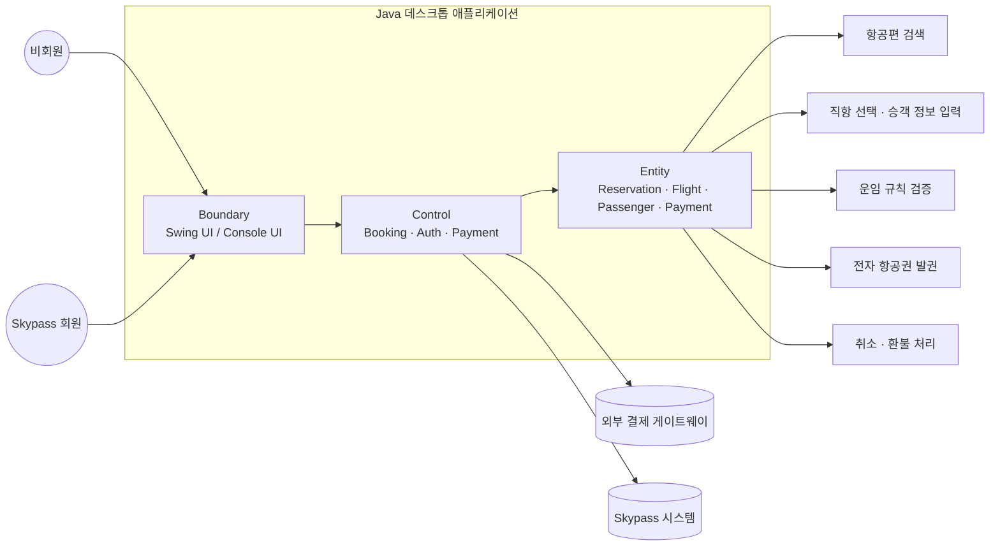
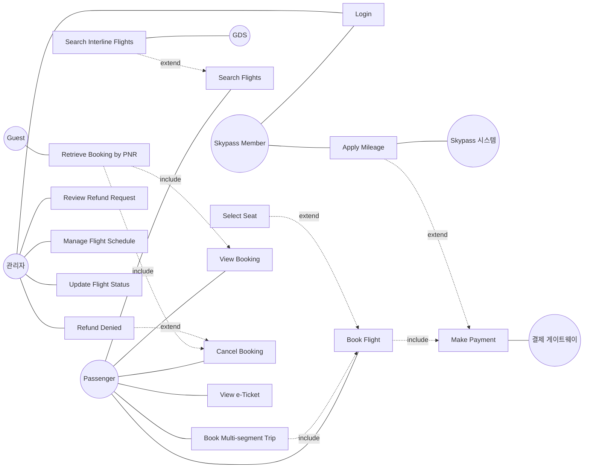
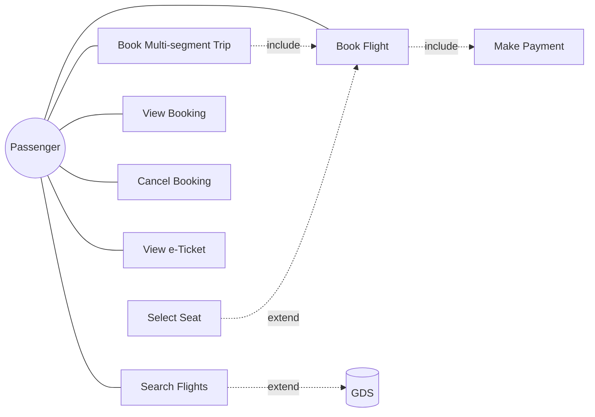
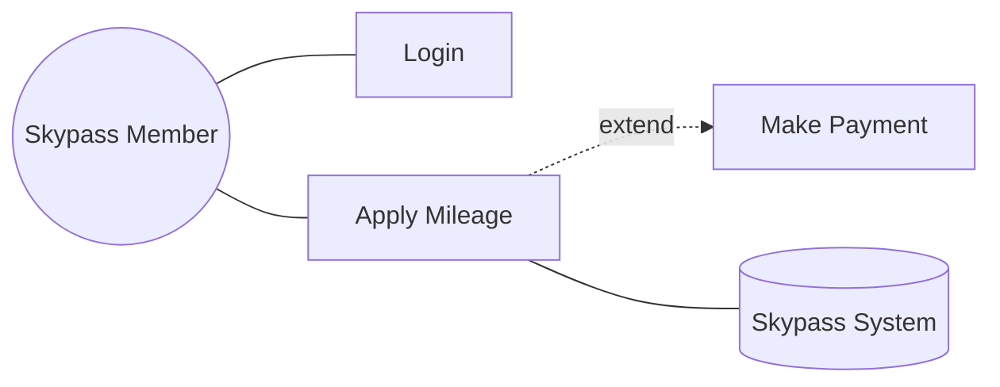
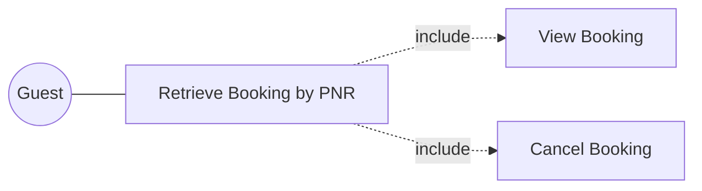
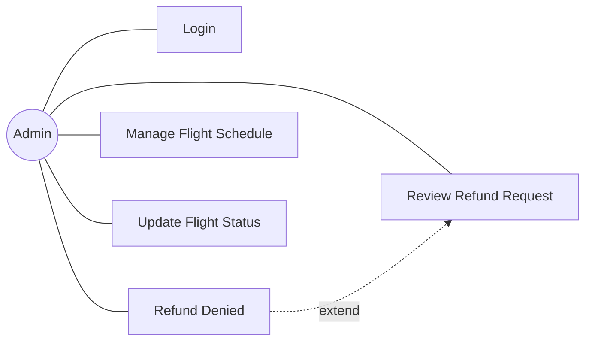
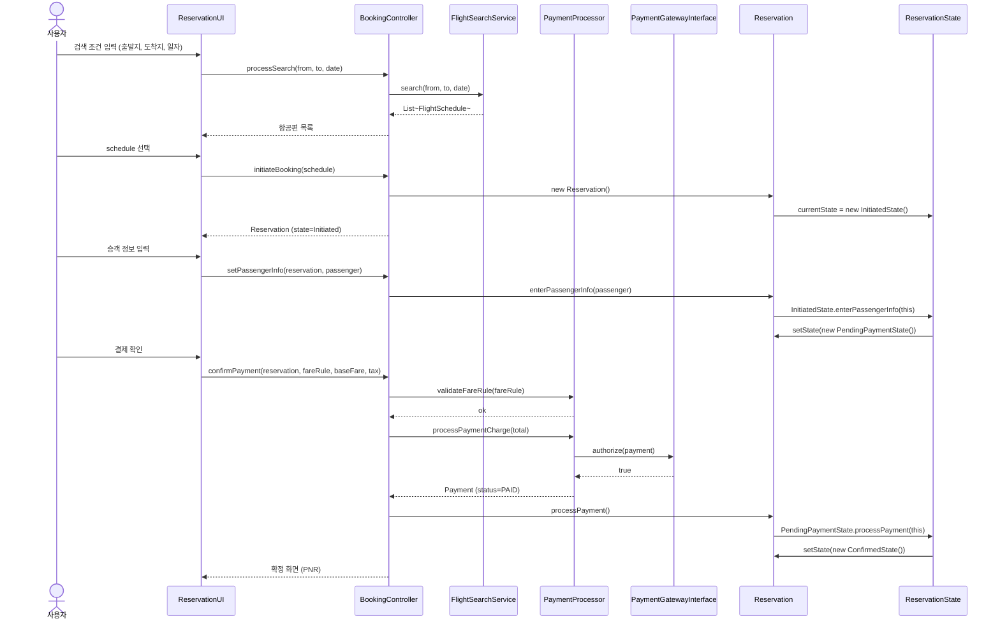
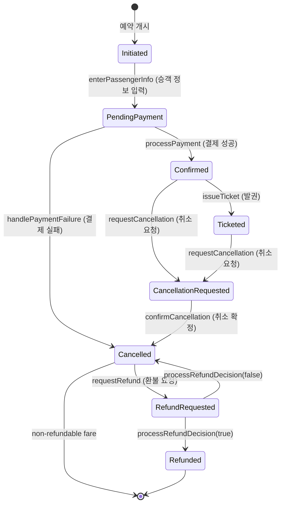

```mermaid
classDiagram
    class ReservationUI {
        <<interface>>
        +displaySearchResults(flightList) void
        +displaySeatMap(aircraftType) void
        +displayBookingConfirmation(pnrNumber) void
        +displayBookingConfirmation(reservation, payment) void
        +displayError(message) void
    }
    class PaymentGatewayInterface {
        <<interface>>
        +sendAuthorizationRequest(amount, paymentInfo) Object
        +receiveTransactionResult() Object
        +sendRefund(originalPaymentId, amount) Object
        +authorize(payment) boolean
    }
    class SkypassInterface {
        <<interface>>
        +verifyMembership(skypassNumber, password) Object
        +getMileageBalance(skypassNumber) int
        +deductMileage(skypassNumber, amount) boolean
        +verifyAndDeduct(skypassNumber, amount) Object
    }
    class GDSInterface {
        <<interface>>
        +searchInterlineFlights(origin, destination) List
        +getPartnerAvailability(flightNumber) List
    }
    class BookingController {
        -authService : AuthService
        -flightSearch : FlightSearchService
        -paymentProcessor : PaymentProcessor
        +processSearch(from, to, date) List~FlightSchedule~
        +initiateBooking(schedule) Reservation
        +setPassengerInfo(reservation, passenger) void
        +confirmPayment(reservation, fareRule, baseFare, tax) Payment
        +currentMember() Member
    }
    class AuthService {
        -memberBySkypass : Map~String, Member~
        -current : Member
        +registerSample(member, skypassNumber) void
        +login(skypassNumber, password) Member
        +logout() void
        +currentMember() Member
    }
    class FlightSearchService {
        -catalog : List~FlightSchedule~
        +addSchedule(schedule) void
        +search(from, to, date) List~FlightSchedule~
    }
    class PaymentProcessor {
        -gateway : PaymentGatewayInterface
        +validateFareRule(fareRule) boolean
        +calculateTotalAmount(baseFare, tax) long
        +processPaymentCharge(amount) Payment
    }
    class RefundHandler {
        +evaluateRefund(pnr, fareClass) Object
        +getRefundDetail(requestId) RefundRequest
        +processRefund(requestId, approvedAmount) void
        +denyRefund(requestId, reason) void
        +getPendingRequests() List
    }
    class Reservation {
        -reservationId : Long
        -reservationNumber : String
        -requester : User
        -status : ReservationStatus
        -createdAt : LocalDateTime
        -passengers : List~Passenger~
        -payments : List~Payment~
        -itinerary : Itinerary
        -tickets : List~Ticket~
        -currentState : ReservationState
        +enterPassengerInfo(passenger) void
        +processPayment() void
        +handlePaymentFailure() void
        +issueTicket() void
        +requestCancellation() void
        +confirmCancellation() void
        +requestRefund() void
        +processRefundDecision(approved) void
        +setState(next) void
        +getStateName() String
        +canBeCancelled() boolean
    }
    class ReservationState {
        <<interface>>
        +name() String
        +enterPassengerInfo(ctx) void
        +processPayment(ctx) void
        +handlePaymentFailure(ctx) void
        +issueTicket(ctx) void
        +requestCancellation(ctx) void
        +confirmCancellation(ctx) void
        +requestRefund(ctx) void
        +processRefundDecision(ctx, approved) void
    }
    class AbstractReservationState {
        <<abstract>>
        +enterPassengerInfo(ctx) void
        +processPayment(ctx) void
        +handlePaymentFailure(ctx) void
        +issueTicket(ctx) void
        +requestCancellation(ctx) void
        +confirmCancellation(ctx) void
        +requestRefund(ctx) void
        +processRefundDecision(ctx, approved) void
    }
    class InitiatedState {
        +name() String
        +enterPassengerInfo(ctx) void
    }
    class PendingPaymentState {
        +name() String
        +processPayment(ctx) void
        +handlePaymentFailure(ctx) void
    }
    class ConfirmedState {
        +name() String
        +issueTicket(ctx) void
        +requestCancellation(ctx) void
    }
    class TicketedState {
        +name() String
        +requestCancellation(ctx) void
    }
    class CancellationRequestedState {
        +name() String
        +confirmCancellation(ctx) void
    }
    class CancelledState {
        +name() String
        +requestRefund(ctx) void
    }
    class RefundRequestedState {
        +name() String
        +processRefundDecision(ctx, approved) void
    }
    class RefundedState {
        +name() String
    }
    class Passenger {
        -passengerId : Long
        -name : String
        -contactInfo : String
        -firstName : String
        -lastName : String
        -dateOfBirth : LocalDate
        -nationality : String
        -passportNumber : String
        -passengerType : PassengerType
        +getFullName() String
        +getName() String
        +getContactInfo() String
        +getPassengerType() PassengerType
    }
    class SkypassMember {
        -skypassNumber : String
        -tier : String
        +getSkypassNumber() String
        +getTier() String
    }
    class Guest {
        -guestSessionId : String
        +getGuestSessionId() String
    }
    class MileageAccount {
        -balance : int
        +getBalance() int
        +updateBalance(remainingMileage) void
    }
    class Itinerary {
        -tripType : String
        +getTripType() String
        +getSegments() List
    }
    class Segment {
        -sequenceNumber : int
        -departureTime : LocalDateTime
        -arrivalTime : LocalDateTime
        -connectionTime : Duration
        +getSequenceNumber() int
        +getDepartureTime() LocalDateTime
    }
    class FareRule {
        -fareRuleId : Long
        -fareClass : String
        -refundable : boolean
        -changeFee : BigDecimal
        -cancellationPenalty : BigDecimal
        +getFareClass() String
        +isRefundable() boolean
        +getChangeFee() BigDecimal
        +getCancellationPenalty() BigDecimal
    }
    class Payment {
        -paymentId : Long
        -amount : BigDecimal
        -paymentMethod : PaymentMethod
        -status : PaymentStatus
        -paidAt : LocalDateTime
        +pay() void
        +fail() void
        +isRefundable() boolean
        +addRefund(refund) void
    }
    class FlightSchedule {
        -scheduleId : Long
        -flight : Flight
        -aircraftType : AircraftType
        -departureDateTime : LocalDateTime
        -arrivalDateTime : LocalDateTime
        -status : FlightStatus
        +getFlightNumber() String
        +getDuration() Duration
        +isAvailableForBooking() boolean
        +findSeatInventory(bookingClass) SeatInventory
    }
    class RefundPolicy {
        <<interface>>
        +calculateRefundAmount(baseAmount) int
        +getRefundType() String
    }
    class FullRefundPolicy
    class PartialRefundPolicy
    class NoRefundPolicy

    ReservationState <|.. AbstractReservationState
    AbstractReservationState <|-- InitiatedState
    AbstractReservationState <|-- PendingPaymentState
    AbstractReservationState <|-- ConfirmedState
    AbstractReservationState <|-- TicketedState
    AbstractReservationState <|-- CancellationRequestedState
    AbstractReservationState <|-- CancelledState
    AbstractReservationState <|-- RefundRequestedState
    AbstractReservationState <|-- RefundedState
    Passenger <|-- SkypassMember
    Passenger <|-- Guest
    RefundPolicy <|.. FullRefundPolicy
    RefundPolicy <|.. PartialRefundPolicy
    RefundPolicy <|.. NoRefundPolicy
    Reservation o--> ReservationState : currentState
    Reservation "1" o--> "1..*" Passenger
    Reservation "1" o--> "0..*" Payment
    Reservation "1" o--> "1" Itinerary
    Itinerary "1" o--> "1..*" Segment
    SkypassMember "1" --> "1" MileageAccount
    Reservation --> FareRule
    BookingController --> AuthService
    BookingController --> FlightSearchService
    BookingController --> PaymentProcessor
    BookingController --> Reservation
    BookingController ..> ReservationUI
    PaymentProcessor --> PaymentGatewayInterface
    RefundHandler ..> RefundPolicy
    RefundHandler --> Reservation
    GDSInterface --> FlightSchedule
    FlightSearchService --> FlightSchedule
```

# ✈️ Proposal #0 — Feature Inventory & Iteration 계획

### 대한항공 Skypass 티켓 예약 시스템

[-orange?style=flat-square)](#-1-시스템과-팀)

[**🇬🇧 English version**](proposal-0-feature-inventory.md) · [**📂 Source code**](https://github.com/gimjungwook/KoreanAirReservationDomain)

> [!IMPORTANT]
> ### 📣 지난주 → 이번주
> **지난주에 Proposal #0 초안을 보여드렸는데, 다시 보니 빠진 부분이 많아서 모두 채워 넣었습니다.** 빨간색이 새로 채운 부분이고, 본 발표는 그 변화를 중심으로 진행됩니다.

### 🗺 발표 흐름

| 단계 | 발표 내용 | 본문 위치 |
| :---: | :--- | :---: |
| **1** | 🩹 지난주 outline에서 빠뜨렸던 부분을 어떻게 채웠는지 | [1번](#-1-시스템과-팀) · [5번](#-5-uml-다이어그램-신규-추가) |
| **2** | 🚀 Iteration 1 walking skeleton 시연 | [6번](#-6-iteration-1-구현-신규-추가) |
| **3** | 🔮 Iteration 2에서 무엇을 구현할지 | [6.6번](#-66-다음-iteration-개요) |

### 🩹 새로 채운 부분 한눈에

| | 섹션 | 채운 내용 |
| :---: | :--- | :--- |
| ✨ | **1번 시스템과 팀** | 시스템 범위 · 사용자 유형 · Java 데스크톱 앱 구조 · ECB 계층별 팀 분담 |
| ✏️ | **2번 Feature Inventory** | 전체 기능 목록 기준표와 iteration 번호 제시 |
| 💡 | **3번 Design Pattern Roadmap** | iteration별 inventory와 각 패턴의 채택 근거를 함께 설명 |
| 🎨 | **5번 UML 4종** | Use Case · Class (속성·연산 풀) · Sequence · State (Mermaid 자동 생성) |
| 🚀 | **6번 Iteration 1 구현** | Walking Skeleton 8단계 · 11개 패키지 · State 패턴 3단 위임 구조 · 핵심 클래스 표 · 의도적 한계 4건 |
| 🔮 | **6.6번 Iteration 2-4 개요** | Strategy / Observer / Singleton + Factory Method 구현 계획 한 문단 |

---

| 항목 | 내용 |
| --- | --- |
| 과목 | ECE312 객체지향 설계패턴 (2026년 1학기) |
| 제출물 | Proposal#0 — 7주차 (마감 2026-04-16, 18:00 KST) |
| 팀 | A팀 — 김정욱, 이재호, 김경동 |
| 소스 베이스라인 | `KoreanAirReservationDomain` (Eclipse 자바 프로젝트, 자바 소스 78개) |

> **색상 규칙.** 검정은 원래 Proposal#0 outline에서 그대로 가져온 내용 (Form #1 챕터 도입, Feature Inventory Table, Design Pattern Roadmap, Diagram Policy). 빨간색은 본 제출본에서 그 outline에 새로 추가된 모든 섹션·단락·표·주석을 표시한다.

---

## 📌 1. 시스템과 팀

> [!NOTE]
> 🩹 **발표 단계 1 / 3** — 채운 내용 ① · 시스템 정의와 팀 분담

### 1.1 시스템

본 제안은 **대한항공 Skypass 티켓 예약 시스템**을 대상으로 한다. 설계프로젝트 #1에서 만든 UML 모델을 Java 데스크톱 애플리케이션으로 구현하고, 4번의 iteration을 통해 점진적으로 정제한다.

발표에서는 위 구조를 기준으로 설명한다. 사용자는 비회원과 Skypass 회원으로 나뉘고, Boundary 계층은 Swing UI와 콘솔 UI를 통해 같은 Control 계층에 연결된다. 핵심 도메인은 항공편 검색, 예약 진행, 운임 검증, 결제, 발권, 취소·환불로 이어지는 항공권 예약 생애주기다.

웹 애플리케이션이 아니라 Java 데스크톱 애플리케이션을 선택한 이유는 시러버스의 "the result should be developed using Java application (not Web)" 제약을 충족하기 위해서다. 시연은 Swing UI를 중심으로 하되, 개발 및 검증 편의를 위해 콘솔 프런트엔드도 병행한다.

### 1.2 A팀 (3명)

A팀은 현재 3인 체제로 운영 중이다. 작업 분담은 use case별로 나누지 않고(use case별 분담은 매 iteration마다 익숙치 않은 코드를 다시 학습하게 만들기 때문에 비효율적이다), ECB 계층별로 나누어 각 팀원이 프로젝트 전체 생애주기 동안 한 가지 횡단 관심사를 일관되게 책임지도록 한다.

| 팀원 | 담당 계층 | 구체 책임 (전 iteration 공통) |
| --- | --- | --- |
| 김정욱 | 도메인 & 패턴 | 1. `Reservation` 도메인 모델 2. State 패턴 (iter1) 3. Strategy 환불 family (iter2) 4. Observer (iter3) 5. Singleton + Factory Method (iter4) 6. AmaterasUML 에미터 클래스 7. 통합 |
| 이재호 | Boundary | 1. Swing UI 패널 (`MainFrame`, `LoginPanel`, `SearchPanel`, `PassengerPanel`, `PaymentPanel`, `ConfirmationPanel`, `StateBadge`) 2. `ConsoleReservationUI` 콘솔 프런트엔드 |
| 김경동 | Control & 어댑터 | 1. `PaymentProcessor` 2. `RefundHandler` 3. `PaymentGatewayInterface` 목 구현 4. `AuthService` 5. 4 iteration 전체를 보호하는 JUnit 스위트 |

계층 단위 분담의 효과는 iteration 경계에서 가장 잘 드러난다. iteration 2의 리팩토링에서 환불 정책에 Strategy 패턴을 도입할 때, 변경은 도메인 계층(김정욱)과 control 계층(김경동)에 한정된다 — Boundary 계층(이재호)은 손댈 필요가 없다. 반대로 iteration 1에서 콘솔 UI를 Swing UI로 교체할 때 이재호가 자신의 파일만 수정하면 다른 두 사람과 diff 충돌을 조율할 필요가 없었다. 학생 팀 프로젝트에서 가장 빈번한 머지 충돌의 원인 — 인접한 use case 작업으로 두 사람이 같은 파일을 동시 수정하는 상황 — 을 계층 단위 분담으로 원천 차단한 셈이다.

(이재호·김경동의 영문 표기는 본인 선호 표기 확정 전 placeholder다.)

---

## 📊 2. Feature Inventory (Form #1)

이 챕터는 설계프로젝트 #2(반복개발 실습) 첫 번째 제안 제출물에 들어가는 Feature Inventory다. 두 번째 프로젝트는 설계프로젝트 #1에서 완성한 UML 모델을 자바 데스크톱 앱으로 구현하고 2-3회의 리팩토링 iteration과 3-7개의 디자인 패턴을 통해 점진적으로 개선해 나가는 과정이며, 이 챕터가 그 출발점이다.

기능은 두 단계 계층(Category > Sub-feature)으로 정리되며, 각 sub-feature에는 주로 어느 iteration(1 / 2 / 3 / 4)에 구현될지 표기한다. 숫자는 주된 구현 시점이며, 이후 iteration에서도 리팩토링과 패턴 적용을 통해 계속 다듬어진다.

> **헤더 라벨 변경.** 아래 표 3번째 컬럼을 `i` 에서 `구현 iteration (1 / 2 / 3 / 4)`로 풀어 표기한다 — 인쇄본에서 의미 모호성 제거. 행 데이터는 변경 없음.

### 2.1 전체 Feature Inventory

먼저 전체 기능 목록을 한 번에 보여준다. 이 표의 목적은 시스템 범위를 빠짐없이 보여주는 것이고, 세 번째 컬럼의 iteration 번호는 뒤에서 필터링할 기준값으로 사용한다.

| Category | Sub-feature | 구현 iteration (1 / 2 / 3 / 4) |
| --- | --- | --- |
| Authentication | Member registration | 1 |
|  | Login / Logout (Skypass 회원) | 1 |
|  | Member profile and mileage balance lookup | 2 |
|  | Guest verification (PNR + name + email triple check) | 2 |
| Flight Search and Selection | Flight search (origin, destination, date, pax, trip type) | 1 |
|  | Itinerary detail display (fare rule, seat info, fees) | 1 |
|  | Direct-flight selection | 1 |
|  | Connecting-flight selection with layover validation | 3 |
|  | Multi-city itinerary composition | 3 |
| Booking Flow | Passenger info entry (name, contact, passport) | 1 |
|  | Seat selection (aircraft-specific seat map) | 2 |
|  | 15-minute seat hold management | 3 |
|  | Mileage application (members only) | 3 |
|  | Fare validation (FareRule-based calculation) | 1 |
|  | Payment processing (Payment Gateway integration) | 1 |
|  | Auto-cancel on payment failure | 3 |
| Mileage | Mileage balance lookup (members only) | 3 |
|  | Partial or full mileage redemption | 3 |
|  | Real-time Skypass System verification | 3 |
| Reservation Lookup | Member reservation lookup | 2 |
|  | Guest reservation lookup (after verification) | 2 |
| Cancellation and Refund | Cancellation request intake (Confirmed / Ticketed only) | 2 |
|  | Fare-rule-based refundability check | 2 |
|  | Refund policy selection (Strategy pattern) | 2 |
|  | Automatic refund processing (FareRule-driven) | 2 |
|  | Exceptional refund admin review | 4 |
|  | Refund disbursement (Payment Gateway) | 2 |
| Connecting and Multi-city | Through-check-in for baggage on connections | 3 |
|  | Independent fare calculation per segment (multi-city) | 3 |
| e-Ticket | e-Ticket issuance (PNR generation) | 2 |
|  | e-Ticket PDF download | 4 |
|  | Real-time reservation status tracking | 4 |
| Options and Settings | Font family and size change | 4 |
|  | Language and currency unit change | 4 |

### 2.2 Inventory 읽는 방식

- 이 표는 전체 시스템 범위를 먼저 보여주기 위한 기준표다.
- 세 번째 컬럼의 iteration 번호를 기준으로 기능을 필터링한다.
- 다음 Design Pattern Roadmap에서 각 iteration inventory와 적용 패턴을 함께 설명한다.

---

## 🎯 Design Pattern Roadmap (minimum 3, maximum 7)

- 설계프로젝트 #1 최종 보고서에 이미 반영된 State, Strategy가 iteration 1·2의 주축이다.
- iteration 3과 4에서 Observer와 Singleton을 추가하여 총 4개를 목표로 한다.
- iteration 4에서 Factory Method를 도입하여 5개로 확장하는 옵션도 열어둔다.
- 본 과목은 패턴 개수보다 "왜 이 맥락에 이 패턴이 적합한가"를 평가하므로, 아래에서는 각 iteration의 inventory와 패턴 채택 근거를 함께 설명한다.

### 3.1 Iteration 1 - State 패턴

| Category | Sub-feature | 발표 포인트 |
| --- | --- | --- |
| Authentication | Member registration | 샘플 Skypass 회원을 등록해 로그인 흐름의 시작점을 만든다. |
| Authentication | Login / Logout (Skypass 회원) | 사용자를 식별하고 예약 진행 주체를 확정한다. |
| Flight Search and Selection | Flight search | 예약 happy path의 첫 Boundary-Control 연결이다. |
| Flight Search and Selection | Itinerary detail display | 선택한 항공편의 운임·좌석·수수료 정보를 확인한다. |
| Flight Search and Selection | Direct-flight selection | iteration 1은 가장 단순한 직항 예약만 대상으로 한다. |
| Booking Flow | Passenger info entry | `Initiated → PendingPayment` State 전이를 발생시킨다. |
| Booking Flow | Fare validation | 결제 전 운임 규칙을 검증한다. |
| Booking Flow | Payment processing | `PendingPayment → Confirmed` State 전이를 발생시킨다. |

- Iteration 1은 전체 시스템을 얇게 한 번 관통하는 walking skeleton이다.
- 회원 등록과 로그인으로 사용자를 만들고, 검색 → 직항 선택 → 승객 정보 입력 → 운임 검증 → 결제까지 최소 예약 흐름을 구현한다.
- 핵심은 기능 완성도가 아니라 `Reservation` 생애주기가 실제 코드에서 State 패턴으로 움직인다는 점이다.
- State 패턴 없이 구현하면 `ReservationStatus` enum 기반 if/else 사슬이 길어지고, 상태 추가 때마다 여러 메서드를 함께 고쳐야 한다.
- State 패턴을 적용하면 생애주기 이벤트가 현재 상태 객체에 대한 다형 호출이 되고, 새 상태 추가는 새 클래스 작성으로 끝난다.

### 3.2 Iteration 2 - Strategy 패턴

| Category | Sub-feature | 발표 포인트 |
| --- | --- | --- |
| Authentication | Member profile and mileage balance lookup | 로그인 이후 회원 정보 조회 범위를 넓힌다. |
| Authentication | Guest verification | 비회원도 PNR + 이름 + 이메일로 예약을 조회할 수 있게 한다. |
| Booking Flow | Seat selection | 예약 확정 전에 좌석 선택 단계를 추가한다. |
| Reservation Lookup | Member reservation lookup | 회원의 예약 이력을 조회한다. |
| Reservation Lookup | Guest reservation lookup | 검증된 비회원의 단건 예약 조회를 지원한다. |
| Cancellation and Refund | Cancellation request intake | Confirmed / Ticketed 상태에서만 취소 요청을 받는다. |
| Cancellation and Refund | Fare-rule-based refundability check | 운임 규칙에 따라 환불 가능 여부를 판단한다. |
| Cancellation and Refund | Refund policy selection | Strategy 패턴으로 환불 정책을 선택한다. |
| Cancellation and Refund | Automatic refund processing | 선택된 Strategy로 환불 금액과 처리를 계산한다. |
| Cancellation and Refund | Refund disbursement | 결제 게이트웨이를 통해 환불 지급을 연결한다. |
| e-Ticket | e-Ticket issuance | PNR 생성과 발권 상태를 연결한다. |

- Iteration 2는 iteration 1에서 만들어진 예약을 조회, 발권, 취소, 환불 가능한 대상으로 확장한다.
- 회원과 비회원 모두 예약을 찾을 수 있어야 하므로 예약 조회 기능이 먼저 들어간다.
- Confirmed / Ticketed 상태의 예약에 대해서만 취소 요청을 받는다.
- 환불은 운임 규칙에 따라 정책이 달라지므로 Strategy 패턴의 주 적용 지점이다.
- switch 기반 환불 구현은 새 운임 클래스가 추가될 때 환불 코드, 취소 코드, 보고 코드를 함께 건드릴 위험이 있다.
- Strategy는 각 환불 규칙을 `RefundPolicy` 구현 클래스로 분리하고, `RefundHandler`는 선택된 정책만 실행하게 만든다.

### 3.3 Iteration 3 - Observer 패턴

| Category | Sub-feature | 발표 포인트 |
| --- | --- | --- |
| Flight Search and Selection | Connecting-flight selection with layover validation | 환승 대기 시간 검증이 필요한 복합 일정으로 확장한다. |
| Flight Search and Selection | Multi-city itinerary composition | 여러 구간을 조합하는 일정 생성 흐름을 추가한다. |
| Booking Flow | 15-minute seat hold management | 예약 중 좌석 임시 점유와 만료 이벤트를 다룬다. |
| Booking Flow | Mileage application | 회원 마일리지를 운임에 적용한다. |
| Booking Flow | Auto-cancel on payment failure | 결제 실패 이벤트가 예약 취소로 전파된다. |
| Mileage | Mileage balance lookup | 마일리지 적용 전 잔액을 조회한다. |
| Mileage | Partial or full mileage redemption | 부분 또는 전체 마일리지 사용을 지원한다. |
| Mileage | Real-time Skypass System verification | 외부 Skypass 시스템 검증을 연결한다. |
| Connecting and Multi-city | Through-check-in for baggage on connections | 환승 여정의 수하물 연결 조건을 확인한다. |
| Connecting and Multi-city | Independent fare calculation per segment | multi-city 구간별 독립 운임 계산을 수행한다. |

- Iteration 3는 단순 직항 예약을 넘어 비동기 이벤트와 복합 여정을 다룬다.
- 좌석 hold 만료, 결제 실패 후 자동 취소, 외부 Skypass 검증처럼 변화가 다른 객체나 UI 알림으로 전파되어야 하는 기능이 많아진다.
- 항공편 스케줄 변경은 해당 항공편의 모든 예약에 전파되어야 한다.
- 결제 실패 후 자동 취소는 잡고 있던 좌석을 해제해야 한다.
- 이 구조는 한 엔티티가 이벤트를 발행하고 0개 이상의 observer가 소비하는 1:N 관계로 표현된다.

### 3.4 Iteration 4 - Singleton (+ Factory Method)

| Category | Sub-feature | 발표 포인트 |
| --- | --- | --- |
| Cancellation and Refund | Exceptional refund admin review | 자동 처리 밖의 예외 환불을 관리자 검토로 넘긴다. |
| e-Ticket | e-Ticket PDF download | 발권 결과물을 PDF로 내려받는다. |
| e-Ticket | Real-time reservation status tracking | 예약 상태를 사용자에게 실시간으로 보여준다. |
| Options and Settings | Font family and size change | 전역 UI 설정을 Singleton으로 관리한다. |
| Options and Settings | Language and currency unit change | 언어·통화 단위 같은 전역 설정을 일관되게 반영한다. |

- Iteration 4는 최종 polish 단계다.
- 예외 환불 관리자 검토, e-티켓 PDF 다운로드, 예약 상태 실시간 추적처럼 사용자에게 완성도를 보여주는 기능을 마무리한다.
- 전역 설정은 애플리케이션 전체에서 같은 값이 공유되어야 하므로 Singleton 패턴의 사례로 설명한다.
- 폰트 family·크기, 언어, 통화 단위는 실행 중 단일 인스턴스로 관리하는 것이 자연스럽다.
- 옵션 Factory Method는 `Itinerary` 생성(Direct, Connecting, Multi-city)을 `ItineraryFactory.create(...)`로 추출하여 생성 로직 분기를 줄인다.

---

## 🎨 5. UML 다이어그램 (신규 추가)

> [!NOTE]
> 🩹 **발표 단계 1 / 3** — 채운 내용 ② · UML 다이어그램 4종 (Use Case · Class · Sequence · State)

> 본 섹션의 4종 다이어그램은 모두 원래 Proposal#0 outline에 없던 신규 추가다. 본 문서에는 Mermaid 작업본을 싣고, 인쇄/PDF 제출본에서는 동등한 AmaterasUML PNG export로 교체한다. 1st iteration 범위는 시러버스 규칙상 Proposal#0이 빨간 마킹 대상이 없으므로 다이어그램 내부 시각 마킹이 아니라 다이어그램 아래 평문으로 설명한다.

### 5.1 Use Case Diagram

본 시스템의 Amateras Use Case Diagram은 설계프로젝트 #1 모델을 기준으로 16개 use case와 4개 사용자/관리자 액터(Passenger, Skypass Member, Guest, Admin), 3개 외부 시스템(Payment Gateway, Skypass System, GDS)을 가진다. Proposal #0 문서의 Mermaid는 그 구조를 발표용으로 요약한 작업본이며, `src/reservationSystem.ucd`와 `GenerateUseCaseDiagram`이 제출용 다이어그램의 기준이다.

**1st iteration 범위 (Walking Skeleton).** 현재 코드에서 end-to-end로 실행되는 범위는 `Login`, `Search Flights`, `Book Flight`, `Make Payment`의 happy path다. `Select Seat`, `Apply Mileage`, `Cancel Booking`, `View e-Ticket`, 관리자 환불 검토, GDS 환승 검색은 다이어그램에 먼저 고정한 설계 표면이며, 코드에는 컴파일 가능한 stub 또는 비활성 UI placeholder로 존재한다.

#### 5.1.1 Passenger Use Case

- Passenger는 예약의 기본 사용자다.
- 항공편 검색 → 예약 → 결제 → 조회 → 취소 → e-티켓 확인까지 전체 고객 여정을 수행한다.
- Iteration 1에서는 `Search Flights`, `Book Flight`, `Make Payment` happy path만 끝까지 실행된다.
- `Book Multi-segment Trip`, `Select Seat`, GDS 연동은 이후 iteration에서 확장된다.

#### 5.1.2 Skypass Member Use Case

- Skypass Member는 로그인 이후 회원 전용 기능을 사용할 수 있다.
- `Apply Mileage`는 결제 흐름을 확장하는 use case다.
- 마일리지 잔액 조회와 차감은 외부 `Skypass System` 검증과 연결된다.
- Iteration 1에서는 로그인만 포함하고, 마일리지 적용은 iteration 3에서 구현한다.

#### 5.1.3 Guest Use Case

- Guest는 로그인하지 않는 비회원 사용자다.
- PNR 기반 조회를 통해 본인의 예약을 확인한다.
- 검증이 끝난 뒤 `View Booking`과 `Cancel Booking`으로 이어진다.
- 비회원 검증과 예약 조회는 iteration 2에서 본격 구현한다.

#### 5.1.4 Admin Use Case

- Admin은 일반 고객 흐름 밖의 운영 기능을 담당한다.
- 예외 환불 요청을 검토하고, 필요하면 환불 거절 흐름으로 이어진다.
- 운항 스케줄 관리와 항공편 상태 업데이트를 수행한다.
- 관리자 기능은 final polish에 가까우므로 iteration 4에 배치한다.

### 5.2 Class Diagram (ECB)

클래스 다이어그램은 시스템을 ECB 3계층으로 정리한다 — 사용자나 외부 시스템과 어댑팅하는 Boundary, use case를 오케스트레이션하는 Control, 그리고 도메인 데이터와 동작을 가지는 Entity. State 패턴은 전적으로 Entity 계층에 위치하며(`Reservation`과 그 `*State` family), Control 계층(`BookingController`)을 통해 구동된다. 아래 attribute·operation 목록은 소스 파일에서 직접 가져왔으며, 식별자는 코드와 1:1 매핑되도록 영어 그대로 유지한다 (다이어그램 → 소스 추적성). private 필드는 `-`, public 메서드는 `+`로 표기한다.

**1st iteration 범위.** 위 다이어그램의 타입과 주요 operation은 코드베이스에 존재한다. 다만 iteration 1에서 사용자 경로로 실제 실행되는 부분은 `AuthService`, `FlightSearchService`, `BookingController`, `PaymentProcessor`, `Reservation`, `Payment`, 그리고 State family의 `InitiatedState`, `PendingPaymentState`, `ConfirmedState` 중심 happy path다. `Itinerary`, `Segment`, `GDSInterface`, `RefundPolicy` family, 후반 취소·환불 상태 전이는 다이어그램 정합성을 위해 stub 또는 단순 전이로 존재하며, 본격 비즈니스 규칙은 iteration 2 이후에 채운다.

### 5.3 Sequence Diagram — Book Flight (Iteration 1 Happy Path)

본 다이어그램은 한 건의 happy path 예약을 추적한다 — 사용자의 검색 화면 첫 입력부터 확정 페이지 표시까지. State 패턴을 운영 시점에서 본 그림이라 할 수 있다. `Reservation`의 생애주기 메서드는 모두 다형 호출이며, 현재 `*State` 객체에 도달해 `Reservation.setState(...)`로 다음 상태를 지정한다. 이 시나리오에서는 두 번의 상태 전이가 일어난다 — 승객 정보 입력 후 `Initiated → PendingPayment`, 그리고 결제 게이트웨이 승인 후 `PendingPayment → Confirmed`.

### 5.4 State Diagram — Reservation

Reservation의 생애주기는 8개 상태와 12개 전이로 구성된 유한 상태 기계다. `Cancelled`는 환불 불가 운임이면 종착 상태가 될 수 있고, 환불 가능 운임이면 `RefundRequested`로 이어진다. `Refunded`는 항상 종착 상태다. 아래 다이어그램은 `src/reservationState.acd`의 Amateras 상태도를 Mermaid로 옮긴 작업본이다.

**1st iteration 범위.** 실행 시나리오에서 검증하는 전이는 `Initiated → PendingPayment`와 `PendingPayment → Confirmed` 두 개이며, 결제 실패 경로에서는 `PendingPayment → Cancelled`도 동작한다. 후반 취소·발권·환불 전이는 다이어그램과 코드 정합성을 위해 단순 상태 전이로 구현되어 있으나, Ticket 생성, 좌석 해제, 환불 금액 산정, PG 환불 송금 같은 비즈니스 본문은 iteration 2 이후에 채운다.

---

## 🚀 6. Iteration 1 구현 (신규 추가)

> [!IMPORTANT]
> 🚀 **발표 단계 2 / 3** — Iteration 1 Walking Skeleton 시연 (메인 데모)

### 6.1 Walking Skeleton 시나리오

iteration 1은 반복개발의 **Walking Skeleton** 패턴을 의도적으로 따른다. 가장 작은 end-to-end 실행 경로를 가장 먼저 구축한다 — 모든 계층(Boundary, Control, Domain, 외부 Gateway)을 거치되 각 계층의 본문은 가능한 한 단순하게. 목적은 기능 완성이 아니라, 계층 사이의 이음새가 실제로 맞물리는지를 배선 단계에서 증명하는 것이다.

본 코드베이스의 walking skeleton 시나리오는 `App.main(...)`에서 구동되는 happy path 예약이다.

1. **부트스트래핑.** `App.main`이 의존성 그래프를 인스턴스화한다 — `AuthService`, `FlightSearchService`, `MockPaymentGateway`(`PaymentGatewayInterface` 구현), `PaymentProcessor`, `BookingController`, 그리고 `ReservationUI` 구현체 하나.
2. **샘플 데이터.** `SampleData.seedAll(auth, search)`가 in-memory 저장소에 Skypass 회원 1명(`SKY-000-001`), 공항 3곳(ICN, NRT, LAX), 항공편 3건(KE001, KE017, KE123), 운임 규칙 1건(Y, refundable)을 주입한다.
3. **로그인.** `auth.login("SKY-000-001", "pw-stub")`이 `Member`를 반환한다. 비밀번호 검증은 의도적으로 생략 — iteration 2에서 salted hash 검증을 도입한다.
4. **검색.** `booking.processSearch("ICN", "NRT", 2026-05-01)`이 in-memory 카탈로그를 반환한다. 파라미터별 필터링은 iteration 2 작업이며, `FlightSchedule` getter가 연결된 후로 미뤄둔다.
5. **선택.** `booking.initiateBooking(selected)`가 새 `Reservation`을 생성한다. 생성자는 `currentState`를 `new InitiatedState()`로, 레거시 `status` enum을 `CREATED`로 초기화한다. PNR은 `"PNR-" + System.currentTimeMillis()`로 할당된다.
6. **승객 정보 입력.** `booking.setPassengerInfo(reservation, null)`이 `reservation.enterPassengerInfo(passenger)`를 호출하며, 이는 `InitiatedState.enterPassengerInfo(ctx)`로 위임된다. 상태 객체는 `ctx.setState(new PendingPaymentState())`로 응답하고 레거시 enum을 `PENDING_PAYMENT`로 동기화한다. 콘솔에 `[STATE] Initiated -> PendingPayment`가 출력된다.
7. **결제.** `booking.confirmPayment(reservation, fareRule, 450 000L, 50 000L)`가 운임 규칙을 검증하고, 총액(500 000 KRW)을 계산하고, `paymentProcessor.processPaymentCharge(total)`을 호출한다. processor는 `Payment`를 빌드하고 `MockPaymentGateway.authorize(payment)`(true 반환)에 위임한 뒤 결제를 `PAID`로 마킹한다. 제어가 controller로 돌아가 `reservation.processPayment()`를 호출하면, 이는 `PendingPaymentState.processPayment(ctx)`로 위임되어 상태가 `ConfirmedState`로 전이된다. 콘솔에 `[STATE] PendingPayment -> Confirmed`가 출력된다.
8. **확정 화면.** `ui.displayBookingConfirmation(reservation, payment)`가 PNR과 최종 상태를 콘솔에 출력한다.

같은 시나리오는 Swing UI(`SwingApp.main`)에서도 끝까지 동작한다. 이는 Boundary 교체가 비파괴적임을 증명한다 — Control과 Domain 계층은 자신이 어떤 UI 구현체와 대화 중인지 의식하지 않는다.

### 6.2 패키지 구성

| 패키지 | 역할 | Iteration 1 활성 클래스 |
| --- | --- | --- |
| `app` | 애플리케이션 진입점, 목 인프라 | `App`, `SwingApp`, `ConsoleReservationUI`, `MockPaymentGateway`, `sample.SampleData` |
| `app.swing` | Swing UI 패널 | `MainFrame`, `LoginPanel`, `SearchPanel`, `PassengerPanel`, `PaymentPanel`, `ConfirmationPanel`, `StateBadge` |
| `boundary` | ECB Boundary 인터페이스 | `ReservationUI`, `PaymentGatewayInterface`, `SkypassInterface`, `GDSInterface`(설계 stub) |
| `control` | ECB Control 서비스 | `BookingController`, `AuthService`, `FlightSearchService`, `PaymentProcessor`, `RefundHandler`(선언만, iter2에서 본격 사용) |
| `domain.reservation` | Reservation 애그리거트 | `Reservation` (Context), `ReservationStatus`, `Itinerary`, `Segment`, `Ticket`, `ReservationItem`, `SeatAssignment` |
| `domain.reservation.state` | State 패턴 | `ReservationState`, `AbstractReservationState`, 8개 구상 상태, `InvalidStateTransitionException` |
| `domain.flight` | Flight·운임 엔티티 | `Flight`, `FlightSchedule`, `FareRule`, `Fare`, `Airport`, `Route`, `Seat`, `SeatInventory` |
| `domain.passenger` | Passenger 엔티티 | `Passenger`, `SkypassMember`, `Guest`, `MileageAccount`, `PassengerType` |
| `domain.payment` | Payment 엔티티 | `Payment`, `PaymentMethod`, `PaymentStatus`, `Refund`, `RefundRequest`, `RefundPolicy` family(Strategy 설계 stub) |
| `domain.user` | Actor 엔티티 | `User`, `Member`, `Admin`, `GuestBookingRequester` |
| `tools` | AmaterasUML 에미터 | `GenerateUseCaseDiagram`, `GenerateClassDiagram`, `GenerateSequenceDiagrams`, `GenerateStateDiagrams` |

### 6.3 State 패턴 구현 방식

State 패턴은 GoF 기술서가 명명한 세 역할에 그대로 매핑되는 3단 위임 구조로 구현되어 있다.

**Context — `Reservation`.** Reservation 애그리거트는 `currentState : ReservationState` 필드를 가지며, 생성자에서 `new InitiatedState()`로 초기화된다. 모든 생애주기 이벤트는 Reservation의 public 메서드(`enterPassengerInfo(Passenger)`, `processPayment()`, `handlePaymentFailure()` 등)로 노출되며, 각 메서드는 즉시 현재 상태 객체에 위임한다 — `currentState.enterPassengerInfo(this)`, `currentState.processPayment(this)` 등. Reservation 자체에는 생애주기 이벤트에 대한 `if (status == X)` 분기가 없다 — 그 책임은 전적으로 상태 객체들에 있다. 비유하자면 신호등과 같다 — 운전자가 할 수 있는 행동은 *현재* 신호가 결정하지, 매번 외부 dispatcher가 색을 검사해 결정하지 않는다.

Reservation은 또한 단일 `setState(ReservationState next)` 메서드를 통해 전이를 수행한다. 설계상 이 메서드는 상태 구현체 내부에서만 호출되어야 한다 (예: `InitiatedState.enterPassengerInfo(ctx)`가 `ctx.setState(new PendingPaymentState())`를 호출). 외부에서 호출하면 패턴의 불변식이 깨진다. 자바의 package-private 접근 제한자는 패키지 경계를 넘어가면 강제력이 없으므로, 이 규약은 `Reservation` Javadoc에 클래스 불변식으로 명시하고 코드 리뷰로 보강한다.

**디폴트 동작 — `AbstractReservationState`.** 추상 기반 클래스가 없다면 모든 구상 상태가 — 거부하는 전이까지 포함해 — 8개 메서드를 모두 구현하고 같은 `throw new InvalidStateTransitionException(...)` 코드를 반복해야 한다. `AbstractReservationState`는 그 보일러플레이트를 한 곳에 모은다 — `ReservationState`의 모든 메서드를 구현하되 `InvalidStateTransitionException(name(), method)`를 throw한다. 구상 상태는 자신이 *허용하는* 전이만 override하면 되고, 나머지는 자동으로 거부된다. 이는 GoF가 추상 프레임워크 클래스에 권장하는 전략과 동일하며, 이 때문에 `RefundedState`의 본문이 비어 있는 것이다 — 어떤 전이도 허용하지 않으므로 8개 거부를 모두 상속받는 것이 정확히 의도한 동작이다.

**구상 상태들.** 8개 구상 상태 클래스가 8개 생애주기 상태에 대응한다. 그중 3개가 iteration 1에서 실제 동작을 수행한다.

- **`InitiatedState`**는 `enterPassengerInfo(ctx)`를 override하여 상태를 `PendingPaymentState`로 설정한다.
- **`PendingPaymentState`**는 `processPayment(ctx)`를 override하여 `ConfirmedState`로, `handlePaymentFailure(ctx)`를 override하여 `CancelledState`로 전이한다.
- **`ConfirmedState`**는 `issueTicket(ctx)`을 override하여 `TicketedState`로, `requestCancellation(ctx)`을 override하여 `CancellationRequestedState`로 전이한다. 전이 자체는 iteration 1에서 동작하지만, `Ticket`을 발급하는 본문과 `RefundHandler`를 호출하는 본문은 iteration 2로 미뤄져 있다.

나머지 5개(`TicketedState`, `CancellationRequestedState`, `CancelledState`, `RefundRequestedState`, `RefundedState`)는 선언만 있고, 본문은 iteration 2-4에서 채워진다. 단 `RefundedState`는 종착 상태이므로 `AbstractReservationState`의 디폴트 거부를 그대로 상속하여 모든 전이를 거부한다.

**왜 레거시 enum이 살아남는가.** 이전 설계는 Reservation에 `ReservationStatus` enum을 두었고, 기존 메서드 일부와 (그리고 향후 모든 보고용 쿼리가) 이를 읽는다. 그 호출자들을 깨뜨리지 않기 위해, 구상 상태의 모든 전이 메서드는 `ctx.updateStatus(ReservationStatus.X)`도 함께 호출하여 enum이 동기 상태를 유지하도록 한다. State 패턴이 전이의 진리원(source of truth)이 되고, enum은 레거시 코드가 들여다볼 수 있는 read-only view로 남는다. `Reservation` Javadoc은 이를 정리해야 할 중복이 아니라 의도적인 호환성 결정으로 기록한다.

### 6.4 Iteration 1 핵심 클래스

| 클래스 | ECB 역할 | 책임 | 핵심 메서드 |
| --- | --- | --- | --- |
| `Reservation` | Entity (Context) | 한 PNR에 대한 애그리거트 루트. passenger·item·payment·current state 객체를 보유하며 생애주기는 State에 위임. | `enterPassengerInfo(Passenger)`, `processPayment()`, `handlePaymentFailure()`, `issueTicket()`, `requestCancellation()`, `setState(ReservationState)` |
| `ReservationState` | Interface | 8개 생애주기 이벤트의 다형 디스패치 계약. | `enterPassengerInfo(ctx)`, `processPayment(ctx)`, `handlePaymentFailure(ctx)`, `issueTicket(ctx)`, `requestCancellation(ctx)`, `confirmCancellation(ctx)`, `requestRefund(ctx)`, `processRefundDecision(ctx, approved)` |
| `AbstractReservationState` | Abstract | 디폴트 거부 — 모든 메서드가 `InvalidStateTransitionException` throw. 구상 상태는 허용 전이만 override. | (디폴트 throw 8개 override) |
| `InitiatedState` / `PendingPaymentState` / `ConfirmedState` | State (iter1 활성) | 허용 전이가 실제 코드로 연결됨. | `Initiated.enterPassengerInfo → PendingPayment`; `PendingPayment.processPayment → Confirmed`; `PendingPayment.handlePaymentFailure → Cancelled`; `Confirmed.issueTicket → Ticketed` (전이만, 본문 iter2); `Confirmed.requestCancellation → CancellationRequested` (전이만, 본문 iter2) |
| `BookingController` | Control | Walking Skeleton 전체를 오케스트레이션. | `processSearch(from, to, date)`, `initiateBooking(schedule)`, `setPassengerInfo(r, p)`, `confirmPayment(r, fareRule, baseFare, tax)` |
| `AuthService` | Control | hard-coded 샘플 회원 1명; Login / Logout 구동. | `login(skypassNumber, password)`, `logout()`, `currentMember()` |
| `FlightSearchService` | Control | in-memory 카탈로그 필터(iter1은 카탈로그 전체 반환; 실제 필터링은 iter2). | `addSchedule(s)`, `search(from, to, date)` |
| `PaymentProcessor` | Control | 운임 규칙 검증 + 게이트웨이 통한 결제 처리. | `validateFareRule(FareRule)`, `calculateTotalAmount(base, tax)`, `processPaymentCharge(amount)` |
| `PaymentGatewayInterface` (mock: `MockPaymentGateway`) | Boundary | 외부 결제 사업자 어댑터; 데모용 mock은 `true` 반환. | `authorize(Payment)` |
| `ReservationUI` (impls: `ConsoleReservationUI`, `SwingReservationUI`) | Boundary | 사용자 입력 진입점; 입력 수집 후 `BookingController`로 전달. | `displaySearchResults(...)`, `displayBookingConfirmation(...)`, `displayError(...)` |

### 6.5 Iteration 1 한계 (의도적)

walking skeleton은 끝까지 동작하지만 iteration 2에서 명시적으로 닫을 여러 모서리(corner)가 있다. 미리 나열해 두면 iteration 2 범위가 모호해지지 않는다.

- **`FlightSearchService.search(...)`는 파라미터를 무시하고** in-memory 카탈로그 전체를 반환한다. 다이어그램 정합성을 위해 `FlightSchedule.getFlightNumber()`와 `getDuration()` 같은 조회 메서드는 존재하지만, 검색 predicate는 아직 실제 출도착/일자 매칭을 수행하지 않는다.
- **`AuthService.login(...)`은 어떤 비밀번호 문자열이든 통과시킨다.** 현재 구현은 Skypass 번호로 회원을 조회하여 그대로 반환할 뿐 비밀번호를 검증하지 않는다. iteration 2에서 salted-hash 검증을 도입하고 로그인 실패를 `null` 반환이 아니라 예외로 변환한다.
- **취소·환불·발권 상태 전이는 다이어그램 기준으로 존재하지만 본문은 얇다.** `Ticket` 객체 생성, 좌석 해제, 환불 금액 산정, PG 환불 송금은 아직 실제 use case로 연결되지 않았다.
- **`RefundPolicy` family, `GDSInterface`, `Itinerary`, `Segment`, `SkypassMember`, `Guest`는 현재 설계 stub다.** Amateras Class Diagram의 타입 정합성을 맞추기 위해 코드에 존재하지만, 본격 비즈니스 로직은 iteration 2와 3에서 채운다.
- **Observer, `AppConfig` singleton, `ItineraryFactory`는 아직 코드베이스에 존재하지 않는다.** 위 로드맵에 따라 iteration 3(Observer), iteration 4(Singleton, Factory Method)에 각각 등장한다.

### 🔮 6.6 다음 Iteration 개요

> [!TIP]
> 🔮 **발표 단계 3 / 3** — 다음 주에 무엇을 구현할지 (마무리 슬라이드)

iteration 2는 이미 코드에 stub로 들어온 Strategy 패턴(`RefundPolicy`, `NoRefundPolicy`, `PartialRefundPolicy`, `FullRefundPolicy`)에 실제 환불 금액 산정과 `RefundHandler` orchestration을 채우고, `ConfirmedState.issueTicket`, 취소 체인, e-Ticket 발급, 예약 조회를 실제 use case로 연결한다. 같은 작업에서 `FlightSearchService.search`에 실제 predicate를 도입하고 `AuthService.login`에 salted-hash 검증을 붙인다. iteration 3는 Observer를 도입하여 `Reservation.setState`, `FlightSchedule.changeStatus`, `Payment.fail`에서 이벤트를 발행하고, 이를 결제 자동 취소(좌석 해제), 환승·multi-city 일정(MCT layover 검증 포함), `SkypassInterface`와 연동된 마일리지 클러스터의 동력으로 사용한다. iteration 4는 전역 폰트·언어·통화 설정용 `AppConfig` singleton(`volatile` + double-checked locking), 세 가지 itinerary 변형을 위한 옵션 Factory Method(`ItineraryFactory`), 예외 환불 관리자 경로, e-Ticket PDF 다운로드와 실시간 추적으로 마무리한다.

---

ECE312 객체지향 설계패턴 · 한동대학교 · 2026년 1학기 · A팀 (김정욱 · 이재호 · 김경동)

Made with ☕ and the Gang-of-Four book

