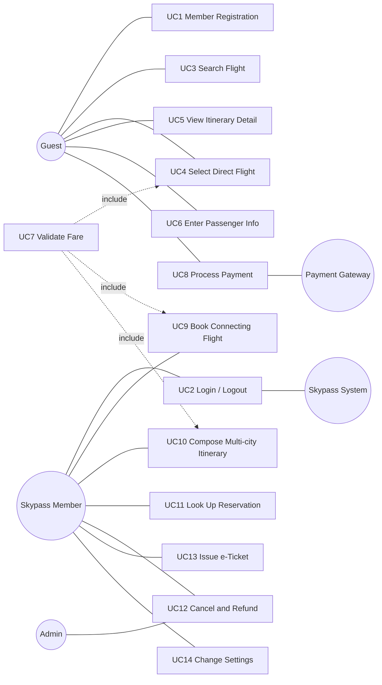
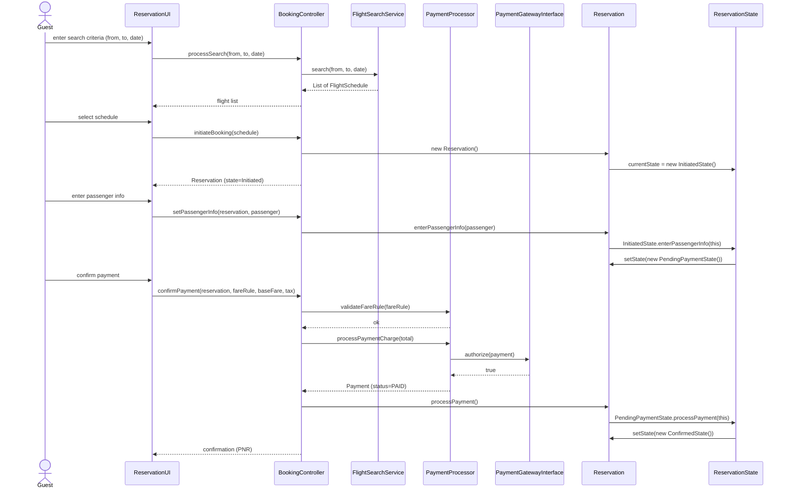
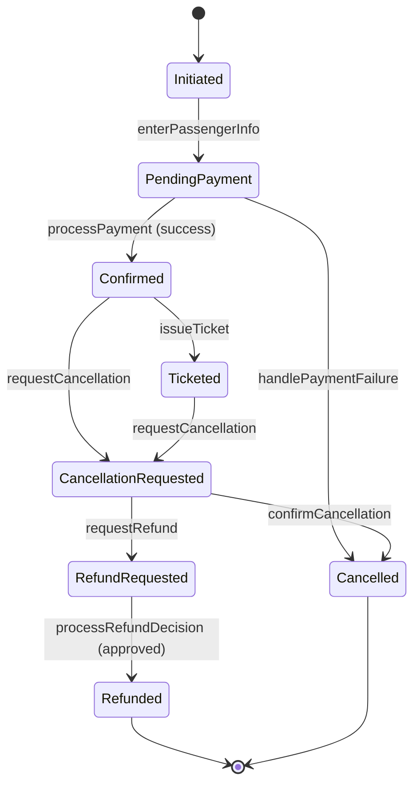

```mermaid
classDiagram
    class ReservationUI {
        <<interface>>
        +displaySearchResults(flightList) void
        +displaySeatMap(aircraftType) void
        +displayBookingConfirmation(pnrNumber) void
        +displayBookingConfirmation(reservation, payment) void
        +displayError(message) void
    }
    class PaymentGatewayInterface {
        <<interface>>
        +sendAuthorizationRequest(amount, paymentInfo) Object
        +receiveTransactionResult() Object
        +sendRefund(originalPaymentId, amount) Object
        +authorize(payment) boolean
    }
    class SkypassInterface {
        <<interface>>
    }
    class BookingController {
        -authService : AuthService
        -flightSearch : FlightSearchService
        -paymentProcessor : PaymentProcessor
        +processSearch(from, to, date) List~FlightSchedule~
        +initiateBooking(schedule) Reservation
        +setPassengerInfo(reservation, passenger) void
        +confirmPayment(reservation, fareRule, baseFare, tax) Payment
        +currentMember() Member
    }
    class AuthService {
        -memberBySkypass : Map~String, Member~
        -current : Member
        +registerSample(member, skypassNumber) void
        +login(skypassNumber, password) Member
        +logout() void
        +currentMember() Member
    }
    class FlightSearchService {
        -catalog : List~FlightSchedule~
        +addSchedule(schedule) void
        +search(from, to, date) List~FlightSchedule~
    }
    class PaymentProcessor {
        -gateway : PaymentGatewayInterface
        +validateFareRule(fareRule) boolean
        +calculateTotalAmount(baseFare, tax) long
        +processPaymentCharge(amount) Payment
    }
    class RefundHandler {
        +evaluateRefund(pnr, fareClass) Object
        +processRefund(requestId, approvedAmount) void
        +denyRefund(requestId, reason) void
    }
    class Reservation {
        -reservationId : Long
        -reservationNumber : String
        -requester : User
        -status : ReservationStatus
        -createdAt : LocalDateTime
        -passengers : List~Passenger~
        -payments : List~Payment~
        -currentState : ReservationState
        +enterPassengerInfo(passenger) void
        +processPayment() void
        +handlePaymentFailure() void
        +issueTicket() void
        +requestCancellation() void
        +confirmCancellation() void
        +requestRefund() void
        +processRefundDecision(approved) void
        +setState(next) void
        +getStateName() String
        +canBeCancelled() boolean
    }
    class ReservationState {
        <<interface>>
        +name() String
        +enterPassengerInfo(ctx) void
        +processPayment(ctx) void
        +handlePaymentFailure(ctx) void
        +issueTicket(ctx) void
        +requestCancellation(ctx) void
        +confirmCancellation(ctx) void
        +requestRefund(ctx) void
        +processRefundDecision(ctx, approved) void
    }
    class AbstractReservationState {
        <<abstract>>
        +enterPassengerInfo(ctx) void
        +processPayment(ctx) void
        +handlePaymentFailure(ctx) void
        +issueTicket(ctx) void
        +requestCancellation(ctx) void
        +confirmCancellation(ctx) void
        +requestRefund(ctx) void
        +processRefundDecision(ctx, approved) void
    }
    class InitiatedState {
        +name() String
        +enterPassengerInfo(ctx) void
    }
    class PendingPaymentState {
        +name() String
        +processPayment(ctx) void
        +handlePaymentFailure(ctx) void
    }
    class ConfirmedState {
        +name() String
        +issueTicket(ctx) void
        +requestCancellation(ctx) void
    }
    class TicketedState {
        +name() String
    }
    class CancellationRequestedState {
        +name() String
    }
    class CancelledState {
        +name() String
    }
    class RefundRequestedState {
        +name() String
    }
    class RefundedState {
        +name() String
    }
    class Passenger {
        -passengerId : Long
        -firstName : String
        -lastName : String
        -dateOfBirth : LocalDate
        -nationality : String
        -passportNumber : String
        -passengerType : PassengerType
        +getFullName() String
        +getPassengerType() PassengerType
    }
    class FareRule {
        -fareRuleId : Long
        -fareClass : String
        -refundable : boolean
        -changeFee : BigDecimal
        -cancellationPenalty : BigDecimal
        +getFareClass() String
        +isRefundable() boolean
        +getChangeFee() BigDecimal
        +getCancellationPenalty() BigDecimal
    }
    class Payment {
        -paymentId : Long
        -amount : BigDecimal
        -paymentMethod : PaymentMethod
        -status : PaymentStatus
        -paidAt : LocalDateTime
        +pay() void
        +fail() void
        +isRefundable() boolean
        +addRefund(refund) void
    }
    class FlightSchedule {
        -scheduleId : Long
        -flight : Flight
        -aircraftType : AircraftType
        -departureDateTime : LocalDateTime
        -arrivalDateTime : LocalDateTime
        -status : FlightStatus
        +isAvailableForBooking() boolean
        +findSeatInventory(bookingClass) SeatInventory
    }

    ReservationState <|.. AbstractReservationState
    AbstractReservationState <|-- InitiatedState
    AbstractReservationState <|-- PendingPaymentState
    AbstractReservationState <|-- ConfirmedState
    AbstractReservationState <|-- TicketedState
    AbstractReservationState <|-- CancellationRequestedState
    AbstractReservationState <|-- CancelledState
    AbstractReservationState <|-- RefundRequestedState
    AbstractReservationState <|-- RefundedState
    Reservation o--> ReservationState : currentState
    Reservation "1" o--> "1..*" Passenger
    Reservation "1" o--> "0..*" Payment
    Reservation --> FareRule
    BookingController --> AuthService
    BookingController --> FlightSearchService
    BookingController --> PaymentProcessor
    BookingController --> Reservation
    BookingController ..> ReservationUI
    PaymentProcessor --> PaymentGatewayInterface
    FlightSearchService --> FlightSchedule
```

# Proposal#0 — Feature Inventory and Iteration Plan

**Korean Air Skypass Ticket Reservation System**

| Field | Value |
| --- | --- |
| Course | ECE312 Object-Oriented Design Patterns (Spring 2026) |
| Submission | Proposal#0 — Week 7 (due 2026-04-16, 18:00 KST) |
| Team | A — Jungwook Kim, Jaeho Lee, Gyungdong Kim |
| Source baseline | `KoreanAirReservationDomain` (Eclipse Java project, 69 source files) |

> **Color convention.** Black text is content carried over verbatim from the original Proposal#0 outline (the Form #1 chapter introduction, the Feature Inventory Table, the Design Pattern Roadmap, and the Diagram Policy). Red text marks every section, paragraph, table, or annotation newly added to that outline for this submission.

---

## 1. System and Team

### 1.1 System

This proposal targets the **Korean Air Skypass Ticket Reservation System**, a Java desktop application that implements, exercises, and progressively refines the UML model produced in Design Project #1. The application supports the entire customer journey of a single flight booking: searching for itineraries, selecting a direct flight, entering passenger information, validating the fare against published rules, processing payment through an external gateway, issuing an electronic ticket, and — in the later iterations — accepting cancellation requests and disbursing refunds.

Two user populations are served. Skypass members authenticate with their Skypass number and (eventually) a hashed password; once logged in they can look up their reservation history and, from iteration 3 onwards, apply accumulated mileage to the fare. Guest users do not log in, but instead are verified at lookup time by a triple-check of PNR plus name plus email. This split is also why the access-control surface of the system is small in iteration 1 and grows in iteration 2: the iteration roadmap deliberately defers guest verification and member-profile features until after the State pattern has stabilised the booking lifecycle.

The product is intentionally a desktop application rather than a web application. This satisfies the syllabus constraint that "the result should be developed using Java application (not Web)" and shapes the boundary layer towards a Swing user interface, with a parallel console front-end retained for development convenience and live demonstration during reviews.

### 1.2 Source Baseline

The implementation lives in the Eclipse Java project at `KoreanAirReservationDomain`. As of this submission, the project contains 69 Java source files organised into eleven packages (described in detail in 6.2). The four UML diagrams in 5 are not hand-drawn: they are emitted programmatically from this source tree by the AmaterasUML emitter classes under `com.koreanair.reservation.tools` — `GenerateUseCaseDiagram`, `GenerateClassDiagram`, `GenerateSequenceDiagrams`, and `GenerateStateDiagrams` — which write AmaterasUML XML files into the Eclipse workspace; those files are then opened in Eclipse and exported as PNG images for the printed deliverable.

The reason for generating diagrams from source rather than drawing them is a practical one. Across iterations the design will change repeatedly, and any change to the class diagram cascades into the sequence diagrams (whose participants must remain consistent with their class methods) and the state diagrams (whose transitions must remain backed by methods on the corresponding entity). Hand-editing four diagrams every time a class signature shifts is both slow and error-prone. With the emitter pattern, a single source change is amplified into all dependent diagrams in one rebuild — closer to "compiling documentation" than to "drawing pictures".

### 1.3 Team A (3 members)

Team A operates with three members, having lost one of the four originally assigned members during Design Project #1. Rather than dividing work by use case — which would force teammates to re-learn unfamiliar code in every iteration — responsibilities are split by ECB layer, so that each member owns one cross-cutting concern throughout the project's life:

| Member | Layer of ownership | Concrete responsibilities (all iterations) |
| --- | --- | --- |
| Jungwook Kim | Domain & Patterns | `Reservation` aggregate; State pattern (iter1); Strategy refund family (iter2); Observer (iter3); Singleton + Factory Method (iter4); the AmaterasUML emitter classes; integration. |
| Jaeho Lee | Boundary | Swing UI panels (`MainFrame`, `LoginPanel`, `SearchPanel`, `PassengerPanel`, `PaymentPanel`, `ConfirmationPanel`, `StateBadge`) and the `ConsoleReservationUI` console front-end. |
| Gyungdong Kim | Control & Adapters | `PaymentProcessor`, `RefundHandler`, the `PaymentGatewayInterface` mock, `AuthService`, and the JUnit suite that protects all four iterations. |

The benefit of layer-ownership is most visible at iteration boundaries. When the refactoring step of iteration 2 introduces the Strategy pattern for refund policies, the change is confined to the domain and control layers (Jungwook and Gyungdong); the boundary layer (Jaeho) remains untouched. Conversely, swapping the iteration-1 console front-end for the Swing UI required no changes outside Jaeho's files. Layer-ownership thus eliminates the most common source of merge conflict in student team projects — two people editing the same file because they happened to be working on adjacent use cases.

(The romanisation of "이재호" and "김경동" is provisional pending each member's preferred spelling.)

---

## 2. Feature Inventory (Form #1)

This chapter is the Feature Inventory for the first proposal submission of Design Project #2 (Iterative Development exercise). It is the starting point for the second project, in which the UML model completed in Design Project #1 is implemented as a Java desktop application and progressively improved through two to three refactoring iterations with three to seven design patterns.

Features are organized into a two-level hierarchy (Category > Sub-feature), and each sub-feature is annotated with the iteration (1 / 2 / 3 / 4) in which it is expected to be primarily implemented. The number indicates the main implementation target; subsequent iterations continue to refine the feature through refactoring and pattern application.

> **Header relabel.** Column 3 of the table below is renamed from `i` to `Implementation iteration (1 / 2 / 3 / 4)` so that the numeric annotation is unambiguous in print. Row data is unchanged.

| Category | Sub-feature | Implementation iteration (1 / 2 / 3 / 4) |
| --- | --- | --- |
| Authentication | Member registration | 1 |
|  | Login / Logout (Skypass member) | 1 |
|  | Member profile and mileage balance lookup | 2 |
|  | Guest verification (PNR + name + email triple check) | 2 |
| Flight Search and Selection | Flight search (origin, destination, date, pax, trip type) | 1 |
|  | Itinerary detail display (fare rule, seat info, fees) | 1 |
|  | Direct-flight selection | 1 |
|  | Connecting-flight selection with layover validation | 3 |
|  | Multi-city itinerary composition | 3 |
| Booking Flow | Passenger info entry (name, contact, passport) | 1 |
|  | Seat selection (aircraft-specific seat map) | 2 |
|  | 15-minute seat hold management | 3 |
|  | Mileage application (members only) | 3 |
|  | Fare validation (FareRule-based calculation) | 1 |
|  | Payment processing (Payment Gateway integration) | 1 |
|  | Auto-cancel on payment failure | 3 |
| Mileage | Mileage balance lookup (members only) | 3 |
|  | Partial or full mileage redemption | 3 |
|  | Real-time Skypass System verification | 3 |
| Reservation Lookup | Member reservation lookup | 2 |
|  | Guest reservation lookup (after verification) | 2 |
| Cancellation and Refund | Cancellation request intake (Confirmed / Ticketed only) | 2 |
|  | Fare-rule-based refundability check | 2 |
|  | Refund policy selection (Strategy pattern) | 2 |
|  | Automatic refund processing (FareRule-driven) | 2 |
|  | Exceptional refund admin review | 4 |
|  | Refund disbursement (Payment Gateway) | 2 |
| Connecting and Multi-city | Through-check-in for baggage on connections | 3 |
|  | Independent fare calculation per segment (multi-city) | 3 |
| e-Ticket | e-Ticket issuance (PNR generation) | 2 |
|  | e-Ticket PDF download | 4 |
|  | Real-time reservation status tracking | 4 |
| Options and Settings | Font family and size change | 4 |
|  | Language and currency unit change | 4 |

> **Distribution rationale (newly added).** The mapping of features to iterations above is not arbitrary. Iteration 1 takes the eight features that together exercise the State pattern's happy path: registration, login, search, direct-flight selection, itinerary detail display, passenger entry, fare validation, and payment processing. Iteration 2 adds the cancellation-and-refund cluster, where the Strategy pattern naturally fits because three refund policies (no refund, partial refund, full refund) are each keyed to fare class. Iteration 3 absorbs the asynchronous and connecting-flight features — payment auto-cancel, mileage application, multi-city itineraries — which call for Observer notifications and a layover-validation algorithm. Iteration 4 closes out with admin features, e-ticket PDF and tracking, and global settings; the Singleton pattern is the textbook fit for the latter, and Factory Method emerges naturally for `Itinerary` creation. Each iteration thus carries one major pattern as its centre of gravity, and the feature inventory makes that alignment explicit before any code is written.

---

## Design Pattern Roadmap (minimum 3, maximum 7)

Two tier-ranked patterns already reflected in the Design Project #1 final report — State and Strategy — serve as the primary axis of iterations 1 and 2. Observer and Singleton are added in iterations 3 and 4, targeting four patterns in total. Factory Method can be introduced in iteration 4 to extend the set to five. Because this course evaluates 'why this pattern fits this context' rather than pattern count, every iteration report details the structural change before and after each pattern application and the rationale for its adoption.

**Iteration 1 — State pattern.** Port the Reservation lifecycle (Initiated → PendingPayment → Confirmed → Ticketed → CancellationRequested → Cancelled → RefundRequested → Refunded) to eight concrete state classes. The detailed design from Design Project #1 (`ReservationState` interface plus eight concrete classes) is translated to code with minimal change.

**Iteration 2 — Strategy pattern.** Apply the refund policy family (`RefundPolicy` interface plus `NoRefundPolicy`, `PartialRefundPolicy`, and `FullRefundPolicy` concrete classes). Branching logic keyed by Y/Q/M/B/H fare class is isolated in individual strategy classes, so that changes to `FareRule` do not leak into refund-handling code.

**Iteration 3 — Observer pattern.** Propagate notifications to affected booking entities when external events occur, such as flight-schedule changes or payment failures. The pop-up-dialog requirement specified in the syllabus — reframed here as boarding reminders, refund-deadline alerts, and similar notifications — integrates naturally with this pattern.

**Iteration 4 (Final) — Singleton pattern.** Manage global configuration objects such as font family and size, language, and currency. A shared single instance across the application is the textbook use case for Singleton. Factory Method can additionally be introduced to extract `Itinerary` creation (Direct, Connecting, Multi-city) into a factory, bringing the pattern count to five.

> **Iteration-by-iteration motivation (newly added).** The roadmap above names the patterns; the paragraphs below explain why each one is necessary at that point in the project rather than sufficient in some other iteration.

> *Iteration 1 — State.* Without the State pattern, every method on Reservation would degenerate into a long if/else chain over a `ReservationStatus` enum, and any new state would require visiting every such chain — a textbook example of "shotgun surgery". With the pattern, each lifecycle event becomes a polymorphic call on the current state object; adding a new state is a new class, not an audit of every method.

> *Iteration 2 — Strategy.* A naïve refund implementation puts a switch over fare class inside `RefundHandler.processRefund(...)`, which means that adding a sixth fare class touches the refund code, the cancellation code, and any reporting code. Strategy packages each refund rule into its own class implementing `RefundPolicy`; `RefundHandler` then asks the `FareRule` for its strategy and applies it without knowing which one it is — strictly additive evolution (OCP).

> *Iteration 3 — Observer.* Several iteration-3 features cross the asynchronous boundary: a flight-schedule change must propagate to all reservations on that flight; an auto-cancel after payment failure must release the held seat; a refund-deadline approach must trigger an alert. Each is naturally an event published by one entity and consumed by zero or more observers — exactly the asymmetric one-to-many relationship Observer is designed for.

> *Iteration 4 — Singleton (+ Factory Method).* Global configuration (font family, font size, language, currency) is the textbook use case for Singleton: one instance per running application, multiple readers, lazy initialisation acceptable. Care will be taken (`volatile` field, double-checked locking) to keep the implementation textbook-correct rather than the toy form that fails under thread interleaving. The optional Factory Method pulls `Itinerary` creation (Direct, Connecting, Multi-city) into `ItineraryFactory.create(...)`, avoiding `new Connecting(new Direct(...))` ladders.

---

## Diagram Policy for Submission (per syllabus)

**Use Case Diagram.** Keep the Design Project #1 final report as-is and merely highlight, with a distinct color (for example, a red outline), the use cases scheduled for the 1st iteration. All use cases remain in place; only the scope is marked.

**Class Diagram.** Keep the Design Project #1 final report as-is and mark, with color (for example, a red outline or red highlight), the classes and methods scheduled for the 1st iteration.

**Sequence Diagram.** Retain the Design Project #1 final report verbatim.

**State Diagram.** Retain the Design Project #1 final report verbatim.

The rule of marking changes from the previous version in red applies to subsequent iteration submissions (1st, 2nd, 3rd, Final). Because Proposal#0 is the first submission, nothing is subject to red-font marking yet.

---

## 5. UML Diagrams (newly added)

> All four diagrams in this section are newly added against the original Proposal#0 outline. Mermaid is used as the source format here; the printed/PDF deliverable substitutes the equivalent AmaterasUML PNG exports. The 1st-iteration scope is described in plain text under each diagram rather than by visual marking, because Proposal#0 carries no red-font marking by syllabus rule.

### 5.1 Use Case Diagram

The system has fourteen use cases distributed over three actors (Guest, Skypass Member, Admin) and two external systems (Payment Gateway, Skypass System). The `Validate Fare` use case is reused via UML's *include* relation by every booking flow that needs to compute a price (direct, connecting, multi-city); the booking flows themselves are kept separate because their orchestration logic differs even when the fare-validation step is identical.

**1st-iteration scope (Walking Skeleton).** Eight use cases participate in the iteration-1 happy path: UC1 Member Registration, UC2 Login / Logout, UC3 Search Flight, UC4 Select Direct Flight, UC5 View Itinerary Detail, UC6 Enter Passenger Info, UC7 Validate Fare, and UC8 Process Payment. The remaining six are deferred to iterations 2–4 in line with the pattern roadmap: UC11 Look Up Reservation and UC12 Cancel and Refund land in iteration 2 with the Strategy pattern; UC9 Connecting Flight, UC10 Multi-city, and the asynchronous parts of UC8 (payment auto-cancel) land in iteration 3 with Observer; UC13 e-Ticket PDF and real-time tracking, and UC14 Settings, land in iteration 4 with Singleton.

### 5.2 Class Diagram (ECB)

The class diagram organises the system into the three ECB layers — Boundary classes adapted to the user or to external systems, Control classes that orchestrate use cases, and Entity classes that own the domain data and behaviour. The State pattern lives entirely in the Entity layer (`Reservation` plus its `*State` family) and is exercised through the Control layer (`BookingController`). Attribute and operation lists below are taken directly from the source files; private fields are prefixed `-`, public methods `+`, and angle-bracket stereotypes mark abstract or interface declarations.

**1st-iteration scope.** Every class shown above is present in the codebase. Of the eight `*State` classes, three (`InitiatedState`, `PendingPaymentState`, `ConfirmedState`) carry executing behaviour in iteration 1; the remaining five ship as declarations whose lifecycle methods either inherit `AbstractReservationState`'s default rejection (raising `InvalidStateTransitionException`) or contain `TODO(iter2)` stubs. The Boundary and Control layers are wired end-to-end in iteration 1; their iteration-2+ extensions are additive — for example, `RefundHandler`, currently declared with empty method bodies, gains real implementations in iteration 2 once the Strategy refund family is in place.

### 5.3 Sequence Diagram — Book Flight (Iteration 1 Happy Path)

This diagram traces a single happy-path booking, from the user's first input on the search screen to the confirmation page. It is the operational view of the State pattern: each lifecycle method on `Reservation` is a polymorphic call that lands in the current `*State` object, which in turn assigns the next state via `Reservation.setState(...)`. Two state transitions occur in this scenario: `Initiated → PendingPayment` after passenger entry, and `PendingPayment → Confirmed` after the payment gateway returns success.

### 5.4 State Diagram — Reservation

The Reservation lifecycle is a finite state machine with eight states and ten transitions. Two states are terminal: `Cancelled` and `Refunded`. The diagram below uses the convention `current → next : event`, where `event` names the method on `Reservation` that triggers the transition.

**1st-iteration scope.** Three transitions execute end-to-end in iteration 1: `Initiated → PendingPayment` via `enterPassengerInfo`, `PendingPayment → Confirmed` via `processPayment` on success, and `PendingPayment → Cancelled` via `handlePaymentFailure`. The remaining seven transitions are declared in the corresponding `*State` classes but their bodies are placeholders carrying `TODO(iter2)` or `TODO(iter3)` markers; iteration 2 brings them online together with the Strategy refund family.

---

## 6. Iteration 1 Implementation (newly added)

### 6.1 Walking Skeleton Scenario

Iteration 1 deliberately follows the **Walking Skeleton** pattern of iterative development. The smallest end-to-end execution path is built first — one that exercises every layer of the architecture (Boundary, Control, Domain, external Gateway) but with the simplest possible body in each. The point is not to ship feature-complete behaviour; it is to prove that the seams between layers actually fit together when wired.

The walking-skeleton scenario in this codebase is the happy-path booking driven from `App.main(...)`:

1. **Bootstrapping.** `App.main` instantiates the dependency graph: `AuthService`, `FlightSearchService`, `MockPaymentGateway` (implementing `PaymentGatewayInterface`), `PaymentProcessor`, `BookingController`, and one `ReservationUI` implementation.
2. **Sample data.** `SampleData.seedAll(auth, search)` populates the in-memory store with one Skypass member (`SKY-000-001`), three airports (ICN, NRT, LAX), three flights (KE001, KE017, KE123), and one fare rule (Y, refundable).
3. **Login.** `auth.login("SKY-000-001", "pw-stub")` returns a `Member`. Password verification is intentionally skipped at this stage; iteration 2 introduces salted-hash verification.
4. **Search.** `booking.processSearch("ICN", "NRT", 2026-05-01)` returns the in-memory catalogue. Filtering by parameters is iteration-2 work, deferred until the `FlightSchedule` getters are wired through.
5. **Selection.** `booking.initiateBooking(selected)` constructs a fresh `Reservation`. Its constructor sets `currentState` to `new InitiatedState()` and the legacy `status` enum to `CREATED`. The PNR is allocated as `"PNR-" + System.currentTimeMillis()`.
6. **Passenger entry.** `booking.setPassengerInfo(reservation, null)` calls `reservation.enterPassengerInfo(passenger)`, which delegates to `InitiatedState.enterPassengerInfo(ctx)`. The state object replies with `ctx.setState(new PendingPaymentState())` and synchronises the legacy enum to `PENDING_PAYMENT`. The console prints `[STATE] Initiated -> PendingPayment`.
7. **Payment.** `booking.confirmPayment(reservation, fareRule, 450 000L, 50 000L)` validates the fare rule, computes the total (500 000 KRW), and calls `paymentProcessor.processPaymentCharge(total)`. The processor builds a `Payment`, asks `MockPaymentGateway.authorize(payment)` (which returns `true`), and marks the payment `PAID`. Control returns to the controller, which calls `reservation.processPayment()`. That delegates to `PendingPaymentState.processPayment(ctx)`, which sets the state to `ConfirmedState`. The console prints `[STATE] PendingPayment -> Confirmed`.
8. **Confirmation.** `ui.displayBookingConfirmation(reservation, payment)` prints the PNR and final state to the console.

The same scenario also runs end-to-end through the Swing UI (`SwingApp.main`), which proves that the Boundary swap is non-disruptive: the Control and Domain layers are not aware of which user-interface implementation they happen to be talking to.

### 6.2 Package Structure

| Package | Purpose | Iteration 1 active classes |
| --- | --- | --- |
| `app` | Application entry points and mock infrastructure | `App`, `SwingApp`, `ConsoleReservationUI`, `MockPaymentGateway`, `sample.SampleData` |
| `app.swing` | Swing UI panels | `MainFrame`, `LoginPanel`, `SearchPanel`, `PassengerPanel`, `PaymentPanel`, `ConfirmationPanel`, `StateBadge` |
| `boundary` | ECB Boundary interfaces | `ReservationUI`, `PaymentGatewayInterface`, `SkypassInterface` |
| `control` | ECB Control services | `BookingController`, `AuthService`, `FlightSearchService`, `PaymentProcessor`, `RefundHandler` (declared, iter2 work) |
| `domain.reservation` | Reservation aggregate | `Reservation` (Context), `ReservationStatus`, `Ticket`, `ReservationItem`, `SeatAssignment` |
| `domain.reservation.state` | State pattern | `ReservationState`, `AbstractReservationState`, eight concrete states, `InvalidStateTransitionException` |
| `domain.flight` | Flight and fare entities | `Flight`, `FlightSchedule`, `FareRule`, `Fare`, `Airport`, `Route`, `Seat`, `SeatInventory` |
| `domain.passenger` | Passenger entities | `Passenger`, `MileageAccount` (iter3), `PassengerType` |
| `domain.payment` | Payment entities | `Payment`, `PaymentMethod`, `PaymentStatus`, `Refund` (iter2), `RefundRequest` (iter2) |
| `domain.user` | Actor entities | `User`, `Member`, `Admin`, `GuestBookingRequester` |
| `tools` | AmaterasUML emitters | `GenerateUseCaseDiagram`, `GenerateClassDiagram`, `GenerateSequenceDiagrams`, `GenerateStateDiagrams` |

### 6.3 State Pattern Realisation

The State pattern is realised in three layers of indirection that map directly to the three roles named in the Gang-of-Four description.

**Context — `Reservation`.** The Reservation aggregate holds a `currentState : ReservationState` field, initialised in its constructor to `new InitiatedState()`. Every lifecycle event is exposed as a public method on Reservation (e.g. `enterPassengerInfo(Passenger)`, `processPayment()`, `handlePaymentFailure()`), and each such method delegates immediately to the current state object: `currentState.enterPassengerInfo(this)`, `currentState.processPayment(this)`, and so on. The Reservation itself contains no `if (status == X)` branching for lifecycle events — that responsibility is entirely in the state objects. A useful analogy is a traffic light: the actions a driver may perform are dictated by the *current* light, not by some external dispatcher that inspects the colour every time.

The Reservation also exposes a single `setState(ReservationState next)` method through which transitions are performed. By design, this method is called only from inside the state implementations themselves (for example, `InitiatedState.enterPassengerInfo(ctx)` calls `ctx.setState(new PendingPaymentState())`); calling it from outside breaks the pattern's invariant. Java's package-private modifier is not strict enough to enforce this across packages, so the rule is documented as a class invariant in the `Reservation` Javadoc and reinforced by code review.

**Default behaviour — `AbstractReservationState`.** Without a base class, every concrete state would have to implement all eight transition methods, even those it rejects, and write the same `throw new InvalidStateTransitionException(...)` code in each. `AbstractReservationState` collapses that boilerplate into one place: it implements every method of `ReservationState` to throw `InvalidStateTransitionException(name(), method)`. Concrete states then override only the transitions they allow; everything else automatically rejects. This is the same strategy GoF recommend for abstract framework classes, and it is the reason `RefundedState`'s body is empty — it permits no transitions, so inheriting all eight rejections is exactly the desired behaviour.

**Concrete states.** Eight concrete state classes correspond to the eight lifecycle states. Three of them carry executing behaviour in iteration 1:

- **`InitiatedState`** overrides `enterPassengerInfo(ctx)` to set state to `PendingPaymentState`.
- **`PendingPaymentState`** overrides `processPayment(ctx)` to set state to `ConfirmedState`, and `handlePaymentFailure(ctx)` to set state to `CancelledState`.
- **`ConfirmedState`** overrides `issueTicket(ctx)` to set state to `TicketedState`, and `requestCancellation(ctx)` to set state to `CancellationRequestedState`. The transitions themselves work in iteration 1; the bodies that allocate a `Ticket` and call `RefundHandler` respectively are deferred to iteration 2.

The other five (`TicketedState`, `CancellationRequestedState`, `CancelledState`, `RefundRequestedState`, `RefundedState`) are present as declarations only; their bodies are filled in iterations 2–4, except for `RefundedState`, which is a final state and rejects all transitions by inheriting `AbstractReservationState`'s defaults.

**Why the legacy enum survives.** The earlier design used a `ReservationStatus` enum on Reservation, and several existing methods (and any future reporting query) read it. Rather than break those callers, every state-transition method on the concrete states also calls `ctx.updateStatus(ReservationStatus.X)` so that the enum stays in sync. The State pattern thus becomes the source of truth for transitions, while the enum remains a read-only view that legacy code can inspect. The `Reservation` Javadoc records this as a deliberate compatibility decision rather than as a duplication to clean up.

### 6.4 Important Iteration 1 Classes

| Class | ECB role | Responsibility | Key methods |
| --- | --- | --- | --- |
| `Reservation` | Entity (Context) | Aggregate root for one PNR. Holds passengers, items, payments, and the current state object; delegates lifecycle to State. | `enterPassengerInfo(Passenger)`, `processPayment()`, `handlePaymentFailure()`, `issueTicket()`, `requestCancellation()`, `setState(ReservationState)` |
| `ReservationState` | Interface | Polymorphic dispatch contract for the eight lifecycle events. | `enterPassengerInfo(ctx)`, `processPayment(ctx)`, `handlePaymentFailure(ctx)`, `issueTicket(ctx)`, `requestCancellation(ctx)`, `confirmCancellation(ctx)`, `requestRefund(ctx)`, `processRefundDecision(ctx, approved)` |
| `AbstractReservationState` | Abstract | Default rejection: every method throws `InvalidStateTransitionException`. Concrete states override only allowed transitions. | (eight default-throwing overrides) |
| `InitiatedState` / `PendingPaymentState` / `ConfirmedState` | State (active in iter1) | Allowed transitions wired to actual code. | `Initiated.enterPassengerInfo → PendingPayment`; `PendingPayment.processPayment → Confirmed`; `PendingPayment.handlePaymentFailure → Cancelled`; `Confirmed.issueTicket → Ticketed` (transition only, body iter2); `Confirmed.requestCancellation → CancellationRequested` (transition only, body iter2) |
| `BookingController` | Control | Orchestrates the Walking Skeleton end to end. | `processSearch(from, to, date)`, `initiateBooking(schedule)`, `setPassengerInfo(r, p)`, `confirmPayment(r, fareRule, baseFare, tax)` |
| `AuthService` | Control | Single hard-coded sample member; drives Login / Logout. | `login(skypassNumber, password)`, `logout()`, `currentMember()` |
| `FlightSearchService` | Control | In-memory catalogue filter (returns full catalogue in iter1; real filtering deferred to iter2). | `addSchedule(s)`, `search(from, to, date)` |
| `PaymentProcessor` | Control | Validates fare rule and charges via the gateway. | `validateFareRule(FareRule)`, `calculateTotalAmount(base, tax)`, `processPaymentCharge(amount)` |
| `PaymentGatewayInterface` (mock: `MockPaymentGateway`) | Boundary | Adapter onto external payment provider; mock returns `true` for the demo. | `authorize(Payment)` |
| `ReservationUI` (impls: `ConsoleReservationUI`, `SwingReservationUI`) | Boundary | User-facing entry point; collects inputs and routes to `BookingController`. | `displaySearchResults(...)`, `displayBookingConfirmation(...)`, `displayError(...)` |

### 6.5 Iteration 1 Limitations (Deliberate)

The walking skeleton runs end-to-end but cuts several corners that iteration 2 will explicitly close. Listing them now keeps the iteration-2 scope unambiguous:

- **`FlightSearchService.search(...)` ignores its parameters** and returns the entire in-memory catalogue. The reason is that `FlightSchedule`'s departure-time and route getters return placeholder values at this point; filtering would silently drop every record. Iteration 2 wires the getters and replaces the body with a real predicate.
- **`AuthService.login(...)` accepts any password string.** The current implementation looks the member up by Skypass number and returns it without verifying the password. Iteration 2 introduces salted-hash verification and converts failed logins into an exception rather than a `null` return.
- **`ConfirmedState.issueTicket(...)` and `ConfirmedState.requestCancellation(...)` perform the state transition but have empty bodies.** No `Ticket` is created and no `RefundHandler` call is made. This is the price of keeping iteration 1 focused on the State pattern alone; iteration 2 fills the bodies and connects them to the Strategy refund family.
- **`RefundHandler`, `RefundPolicy`, observers, the `AppConfig` singleton, and `ItineraryFactory` are not yet present.** They appear in iterations 2 (Strategy), 3 (Observer), and 4 (Singleton, Factory Method) respectively, in line with the roadmap above.

### 6.6 Next-Iteration Outlook

Iteration 2 introduces the Strategy pattern as a `RefundPolicy` family (`NoRefundPolicy`, `PartialRefundPolicy`, `FullRefundPolicy`) and uses it to fill the bodies of `ConfirmedState.issueTicket`, the cancellation chain (`CancellationRequestedState`, `CancelledState.requestRefund`, `RefundRequestedState.processRefundDecision`), and `RefundHandler`; in the same pass `FlightSearchService.search` gets a real predicate, `AuthService.login` gains salted-hash verification, and the Authentication / Reservation Lookup / Cancellation-and-Refund / e-Ticket-issuance rows of the Feature Inventory all light up. Iteration 3 introduces Observer to publish events from `Reservation.setState`, `FlightSchedule.changeStatus`, and `Payment.fail`, which in turn powers payment auto-cancel (seat release), connecting and multi-city itineraries (with MCT layover validation), and the mileage cluster against `SkypassInterface`. Iteration 4 closes out with an `AppConfig` singleton (`volatile` + double-checked locking) for global font / language / currency settings, an optional Factory Method (`ItineraryFactory`) for the three itinerary variants, the exceptional-refund admin path, and e-Ticket PDF download plus real-time tracking — at which point every row in 2 is shipping, the eight `*State` classes carry no remaining `TODO(iterN)` markers, and the 6.1 walking-skeleton happy path still runs unchanged from `App.main(...)` as the standing regression check.
